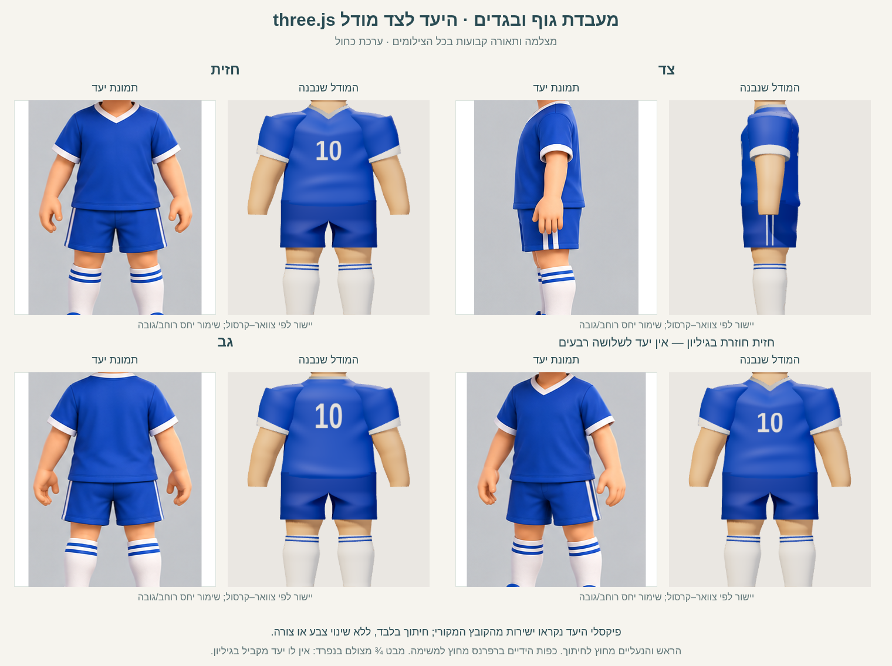
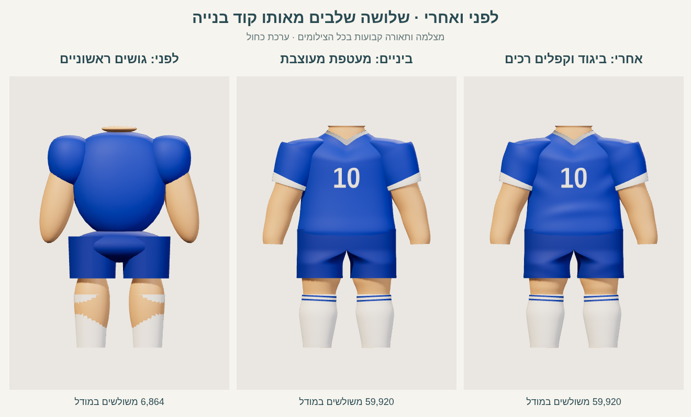

# מעבדת גוף ובגדי הילד — יומן לימוד

זו מעבדה עצמאית ב־three.js. כל הקוד, ספריית הרינדור, כלי הצילום והמסירה נמצאים בתוך `codex-lab/kid-body/`. אין חיבור לאפליקציה ואין שינויים ב־`workout/`, באתר באקה סאן, במעבדת הראש או בקובצי הרפרנס.

נבנו גו, צוואר, זרועות עד שורש כף היד ורגליים עד הקרסול, חולצה עם צווארון V ושרוולים, 10 מלפנים ומאחור, מכנס קצר וגרביים. הראש, כפות הידיים והנעליים אינם נבנים כאן. שני צבעים לבחירה: כחול/לבן ואלמוג/שמנת עם מכנס כחול־ירוק.

## פיקסלי היעד וההשוואה

**הייתה לי גישה לפיקסלים המקוריים של שלושת קובצי היעד.** צפיתי בקבצים ישירות מתוך `../ref/`: גיליון המבטים, גיליון ההבעות ודף הידיים/הנעליים. גיליון המבטים הוא המקור לפרופורציות הגוף ולבגדים; שני הקבצים האחרים עוזרים להבין את חומר הצעצוע ואת הצווארון והגרב.

המקור לגיליון ההשוואה הוא `../ref/מבטים - ילד מדף התלבושות.png (1).png`, בגודל 1254×1254. SHA-256: `c25850f5f3cbc53d2309e7779485868e710b12511b725787a44ca5463d4821b6`. לא הוחלפו צבעי המקור ולא צוירה תמונת יעד מחדש. Playwright טען את הקובץ המקורי; פעולת canvas בגיליון רק חותכת וממקמת תמונות.



החיתוך האנכי הוא Y=518–884, בקירוב צוואר–קרסול. חיתוכי העמודות הם X=15–310, 330–610, 620–915 ו־935–1240. המודל מיושר לאותו גובה באמצעות הקרנת נקודות הצוואר והקרסול, והרוחב נשמר באותו יחס; אין מתיחת צללית כדי לייצר התאמה. בקצוות החיתוך יכולים להופיע פיקסלים של צוואר/קצה נעל; כפות הידיים נשמרות במקור ומופיעות בו בלבד.

**העמודה הרביעית במקור היא חזית חוזרת, לא שלושה רבעים.** היא עומדת ליד חזית חוזרת של המודל. צילום [שלושה רבעים](shots/three-quarter.png) קיים בנפרד, בלי להמציא יעד מקביל. הגיליון מציין זאת במפורש. ה־10 אינו בתמונה המקורית; הוא נוסף לפי התדריך.

## הפעלה ושחזור

1. פתחו את [התיקייה](.) ובטרמינל עברו ל־`codex-lab/kid-body/`.
2. התקינו את כלי הצילום בלבד:

```sh
npm ci --cache ./work/npm-cache --no-audit --no-fund
```

3. הפעילו את המעבדה:

```sh
npm run serve
```

4. פתחו את הכתובת שהשרת מדפיס. ברירת המחדל:

```text
http://127.0.0.1:8766/
```

5. בחרו מבט, צבע ושלב. התוצאה הרצויה: הגוף מוצג בשלמותו בלי ראש, כפות ידיים או נעליים; 10 נקרא בשני הצדדים. לחיצה על שלושת השלבים משנה את הגאומטריה, כשהמצלמה והאורות נשארים באותו מקום.
6. לצילום ולמדידה:

```sh
npm run capture
```

הצילום משתמש ב־Chromium מקומי. אם הנתיב שונה:

```sh
CHROMIUM_PATH=/path/to/chromium npm run capture
```

הסקריפט מפעיל וסוגר שרת בעצמו. לבדיקה ידנית של חיתוך נטול ממשק:

```text
http://127.0.0.1:8766/?capture=1&view=front&stage=final&palette=blue
```

`index.html` הוא הדף היחיד. הוא מייבא `scene.mjs`, שמייבא `model.mjs` ו־`vendor/three.module.js` המקומי, revision 160. עותק הספרייה נלקח מהעותק המקומי הקיים במעבדת הראש; מצורף רישיון MIT ב־`vendor/LICENSE`. אין CDN, פונט רשת, מודל חיצוני או תלות npm בזמן הצגת הדף. npm נחוץ רק לצילומים האוטומטיים. קובצי השרטוט ו־NOTES זמינים גם בלי npm; לצפייה ב־ES modules יש להפעיל שרת HTTP.

## מצלמה, תאורה ותנאי המדידה

המצלמה אורתוגרפית: מיקום `(0,0.875,6)`, מבט אל `(0,0.875,0)`, גובה מסגרת 2.12, near=0.1, far=30. רוחב מינימלי 1.34 שומר על הזרועות בתוך מסגרת צרה של טלפון. המסגרת תלויה רק ביחס המסך: `height=max(2.12,1.34/aspect)`. אין התאמה מחדש לפי מודל, שלב או מבט. תנאי המסגרת בפועל נרשמים ב־JSON. המבטים נקבעים על ידי סיבוב הילד בלבד: 0°, −90°, −180° ו־−45° סביב Y.

| אור | מיקום | צבע | עוצמה |
| --- | --- | --- | ---: |
| ראשי | −3,4.5,5 | `#fff2e1` | 3.10 |
| מילוי | 3,2,3 | `#e3edff` | 1.35 |
| אחורי | 1,3,−4 | `#fff5e5` | 2.00 |
| Hemisphere | שמיים / קרקע | `#fff5eb` / `#9da8be` | 1.00 |

ACES filmic, exposure=1, פלט sRGB, רקע `#eae7e2`. צל PCFSoft במפה 1024², bias=−0.0005, normalBias=0.018. מפת הצל מתעדכנת בשינוי המודל/מבט; הפריים עצמו ממשיך להירנדר ב־requestAnimationFrame. החלופות המבריקה והשטוחה משתמשות באותה תאורה ומצלמה.

## המדידות שנאספו

נמדד ב־Chromium 151.0.7922.173 עם Playwright 1.56.1, במסך **390×844 CSS pixels, DPR=2**, כלומר buffer של **780×1688**. הרינדור הוא SwiftShader בתוכנה; זו **אינה מדידה על טלפון פיזי**. לכן אין להסיק ממנה FPS של GPU בטלפון.

| שלב | משולשים במודל | משולשים כולל האולפן | זמן יצירת מודל חציוני, ms | FPS | פריימים בחלון המדידה |
| --- | ---: | ---: | ---: | ---: | ---: |
| נפחים בסיסיים | 6,864 | 6,866 | 3.20 | 3.92 | 20 |
| מעטפת מעוצבת | 59,920 | 59,922 | 32.25 | 1.67 | 9 |
| קפלים וגימור | 59,920 | 59,922 | 30.65 | 1.21 | 7 |

זמן בנייה פירושו כאן זמן יצירת הגאומטריות, החומרים והטקסטורות בדפדפן, ולא שעות עבודת המפתח. בכל שלב נבנו 20 עותקים מחדש; חציון וזמני כל הדגימות נשמרו. הרינדור של דגימות הביניים נדחה, כדי למדוד בנייה בלי להעלות 20 גרסאות ל־GPU. זמן `rebuildWallTimeMs` הנוסף כולל פינוי העותק הקודם והכנסה לסצנה. זמן העלאה ל־GPU אינו נכלל בטענה על זמן בנייה.

FPS נמדד בדף רינדור פעיל אחד, לאחר חימום של 1 שנייה ובחלון מבוקש של 5 שניות. הזמן בפועל, מספר הפריימים, חציון זמן פריים ו־p95 נשמרו. סגרתי את דף הצילומים לפני המדידה כדי שלא יתחרה ברינדור הטלפון. המספר הסופי נמוך בסביבת התוכנה הזאת: 1.21 FPS, עם 7 פריימים בחלון; זה מדגם קצר ונתון לצורכי השוואה, ולא הבטחת ביצועים.

ספירת המשולשים היא ספירת הטופולוגיה פעם אחת לכל mesh. היא כוללת גם גו/גפיים שמכוסים בבגד, ואינה מספר המשולשים שנשלחים בכל מעברי הצל/החומר ל־GPU. האולפן מוסיף שני משולשים של רצפה. הקפלים משנים קודקודים קיימים ולכן אינם מעלים את הספירה ביחס ל־shaped.

הנתונים המלאים: [metrics.json](shots/metrics.json), [capture.json](shots/capture.json), [reference.json](reference.json). לא נעשה שימוש במדידה משוערת במקום בדפדפן.

## ראיות לפני ואחרי



כל שלושת הצילומים בגיליון הזה נוצרו באותה ריצה, ב־420×600 וב־DPR=1. `blockout` הוא אב־טיפוס אמיתי: גם חדירת הרגל דרך גרב הגליל נשמרה כדי להסביר למה נדרש פרופיל עוטף. `shaped` הוא בגד ללא שדות הקפל; `final` מוסיף אותם ואת גימור החומר.

תמונות האבחון מן הניסיונות המוקדמים נשמרו בנפרד, בתצוגת האולפן הישנה 584×650: [חזית ראשונה](shots/first-front.png), [צד ראשון](shots/first-side.png), [¾ ראשון](shots/first-three-quarter.png). הן מראות שרשרת טבעות, חורי כתפיים וצל מלבני במכנס. [חדירת הגו לצווארון](shots/experiments/neck-intersection.png) ו־[חדירת ירך בצד](shots/experiments/side-intersection.png) נשמרו גם הן. אלה תמונות אבחון, לא השוואה כמותית באותו גודל מסך. ניסויי המספר והחומר הסופיים מצולמים ב־420×600: [מספר שטוח](shots/experiments/flat-numbers.png), [חומר מבריק](shots/experiments/glossy.png).

## טכניקות ופרמטרים

לכל שיטה להלן מתועדים הפעולה, הפרמטרים, הסיבה, המצב לפני/אחרי והניסיון שנפסל. כשחלופה לא נבדקה, זה כתוב במפורש; אין ייחוס תוצאה לניסוי שלא נעשה.

## 1. יחידת ראש, נקודות ציון ומיפוי אנכי

ראש השיער–סנטר בתמונה הוא בערך 250 פיקסלים; צוואר–קרסול בערך 370. לכן הגובה של החלק שנבנה כאן הוא 1.50 יחידות ראש. ביחד עם ראש ועם מרווח נעל של 0.15, גובה הדמות המתוכנן הוא 2.65 ראשים. הראש והנעל הם יחידות מדידה בלבד ואינם מוצגים במודל.

המידות הסופיות: קרסול 0.10, קצה גרב 0.46, מכפלת מכנס 0.57, מותן/מכפלת חולצה 0.856, כתף 1.49, ראש צוואר 1.60. זרועות מקבלות מיפוי נפרד: קצה שורש כף היד 0.80. כל המספרים ביחידות ראש. רוחב גוף טיפוסי לפני הבגד 0.54–0.59; חולצה 0.61–0.66. הפנייה קדימה היא ‎+Z, וגובה הוא ‎+Y.

לפני: נבנתה מערכת עבודה שבה הצוואר הגיע ל־1.67 והקרסול ל־0.08, כלומר גוף 1.59 ראשים. אחרי: נאפו נקודות הציון האנכיות לתוך הקודקודים, בלי לשנות את המצלמה. המיפוי מקצר את הרגליים ביחס לגו ולזרועות. מערכת העבודה הראשונית ארוכה יחסית לפיקסלים של היעד; זו השוואת פרמטרים לפני אפייה, ולא צילום של דמות נוספת בגובה 1.59. תיקון אחיד של כל הגובה היה מקצר גם את הזרועות; לכן נקבע להן מיפוי נפרד.

## 2. גו ובגד כחתכים מחוברים

החולצה היא רשת loft: 64 חלוקות סביב הגוף ו־58 לאורך הגובה, עם רדיוסים משתנים. חתכי העבודה המרכזיים `(y,rx,rz)` הם `(0.918,0.320,0.197)`, `(0.948,0.331,0.203)`, `(1.04,0.316,0.196)`, `(1.19,0.304,0.195)`, `(1.34,0.308,0.203)`, `(1.44,0.319,0.195)`, `(1.49,0.281,0.160)`. אלה נקודות לפני מיפוי הגובה הסופי. בחלק העליון יש מעבר רך לרדיוס הצוואר `(0.132,0.112)` בין 1.36 ל־1.58. ה־loft יוצר בטן מעט מלאה, מותן מעט צרה וכתפיים מעוגלות, כך שהבגד נראה כמו מעטפת צעצוע.

הגו שבתוך החולצה הוא גרסה קטנה של אותו משטח: ‎X×0.89, ‎Z×0.88 והנמכה של 0.01. כך הוא משאיר עובי לבגד ואינו חותך דרך שקע ה־V. הוא אינו מטיל צל על הבגד שמכסה אותו.

לפני: נפחי `blockout` הם כדורים מתוחים וצילינדרים. אחרי: `shaped` משתמש בחתכים מחוברים, ו־`final` מוסיף שדות קפל וגימור חומר. ניסוי גו עם קצה עליון אופקי יצר פס עור ישר על החזה כשהחולצה עוצבה עם V; רואים אותו בצילומי הניסיון הראשון וב־v4. צורת הגו הפנימית הוחלפה כדי לעקוב אחר הצווארון. אין כאן הוכחה שהשיטה מתאימה לגוף עירום: המודל הפנימי נבנה למעטפת הבגד הזאת.

## 3. זרוע, שרוול ורגל: מסלול עם אינטרפולציה חלקה

הזרוע היא mesh אחד משורש כף היד ועד הכתף. הקצה העליון המכוסה בשרוול נעצר בגובה עבודה 1.38, כדי שהעור לא יצא מעל כיפת השרוול. נקודות הבקרה של הציר עוברות בקירוב דרך `(x,y)=(0.496,0.790),(0.465,0.960),(0.441,1.065),(0.387,1.190),(0.263,1.445)` לפני מיפוי הגובה. רדיוס הזרוע נע מ־0.065 בשורש כף היד לכ־0.12 בכתף. טבעות החתך ניצבות למשיק של המסלול; לכן הזרוע אינה ערימה של כדורים. יש 48 חלוקות סביב כל גפה. הקצה בשורש כף היד הוא משטח חיבור שטוח, ללא כף יד.

לשרוול חתכים נפרדים, רדיוס 0.124–0.156, והוא חופף לכתף. כיפת הכתף נבנית באותו loft: רדיוס 0.135 בגובה עבודה 1.446, רדיוס 0.080 בגובה 1.469 ומרכז X=0.221, ורדיוס 0.001 בגובה 1.486 ומרכז X=0.184. מעל גובה 1.35 הטבעת מתיישרת בהדרגה עד 1.446, במקום להרים את הקצה החיצוני עם משיק הציר. היא סוגרת את הפתח בלי להוסיף כדור חיצוני. הפס הלבן גבוה 0.035, ורשת שפה קצרה מחברת את החוץ לפנים ליד הזרוע.

לרגל יש ציר קצר ורדיוסים 0.092 בקרסול, 0.117 בברך ובירך המכוסה 0.126 לרוחב ו־0.121 לעומק. רדיוס הירך הראשון, 0.142, חדר דרך האגן המשותף ויצר שני משולשי עור בגב המכנס; הקטנת החלק המכוסה הסירה אותם בלי לשנות את הברך החשופה. היא מסתיימת במשטח הקרסול ולא בכף רגל.

לפני: interpolation מסוג smoothstep בכל מקטע איפס את שיפוע המסלול בכל נקודת בקרה. זה יצר טבעות וכיפופים שנראו כמו שרשרת חלקים, בעיקר בשרוול ובמרפק. אחרי: Hermite עם שיפועים משותפים לשני המקטעים הסמוכים נותן מעבר C1 לאורך המסלול ולרדיוסים. הצילומים הראשונים מראים את התוצאה שנפסלה; תמונות v3 ומעלה מראות זרוע רציפה. שרוול שנשאר פתוח בחלק העליון יצר חור כהה מעל הכתף; הארכת ה־loft לכיפה סגרה אותו. שרוול ללא שפה פנימית השאיר מרווח חד ליד פס הסיום; נוספה שפה לבנה ברוחב המרווח.

## 4. צווארון V בתוך הגאומטריה

הפתח בחולצה עצמו מקבל שקע קדמי; הצווארון הלבן עוקב אחר הפתח כרצועה טבעתית ולא כטורוס נפרד. עומק ה־V במערכת העבודה הוא 0.118. פרופיל ‎|X| מעוגל בסביבת המרכז באמצעות `sqrt(cos²(theta)+0.0025)`, כדי להשאיר V בלי פינה חדה. ברצועה הסופית נדגמים פני החולצה עצמם: פרמטר הגובה יורד מ־1.58 עד 1.537, כלומר טווח עבודה 0.043. ההבלטה מעל הבגד היא 0.0015 ועיגול השפה 0.0008. הרצועה הראשונה הורחבה בנפרד ב־0.027 והונמכה ב־0.026; היא חתכה את החולצה ויצרה שיניים לבנות זעירות. דגימה חוזרת של אותו משטח החליפה אותה. 80 חלוקות סביב הצווארון ו־6 לרוחבו.

לפני: שקע V הוכנס רק לטבעות בגבהים 1.44–1.58. smoothstep בטווח הצר גרם לטבעות לרדת חזרה זו על זו; גם שינוי לינארי בטווח זה השאיר מדף כמעט אופקי ליד החזה. אחרי: עומק השקע נפרש באמצעות smoothstep מ־1.24 עד 1.58; שיפועו המרבי נמוך מ־1 ולכן הגובה עולה לאורך ה־loft. מעבר הרדיוסים אל הצוואר מתחיל כבר ב־1.36. שקע המבוסס רק על `sin(theta)` נתן צורת U בחזית; פרופיל ‎|X| המעוגל מחליף אותו ב־V.

## 5. מכנסיים קצרים: שני פתחים ואגן משותף

כל רגל של המכנס מתחילה בחתך אליפטי: מרכז ‎X=±0.181, רדיוס ‎X=0.155, רדיוס עומק 0.179. בין גובה עבודה 0.735 ל־0.837 החתך הופך לחצי אגן בעל רוחב כולל 0.668 ועומק 0.197. שתי המחציות חולקות חזית וגב לאורך המרכז; הקירות הפנימיים שלהם נפגשים בתוך האגן. מכפלת כל רגל נשארת נפרדת. הרשת אינה cloth simulation ואינה מיועדת לאנימציה בשלב הזה.

המכפלת היא פס באותו צבע, גובה 0.014 והבלטה 0.0013. שני פסי הצד דקים: רוחב זוויתי 0.055, סביב ‎theta=±0.11, והבלטה 0.0018 מעל המשטח.

לפני: במראה הראשון היה מלבן צל שחור וחד בירך השמאלית. אחרי: בצד שמאל שיקוף הקודקודים הפך גם את כיוון המשולשים. תיקנתי את סדר האינדקסים, ומפות הצל משתמשות בפאה החיצונית `FrontSide`. הצילומים v4 מוכיחים שהמלבן נעלם. DoubleSide עדיין מאפשר לראות שפות בגד פנימיות, אבל אינו תחליף לכיוון משולשים נכון. סימון המספרים נעשה על משטח נפרד ואינו אחראי לתיקון הזה.

## 6. קפלים רכים כשדות גאוסיאניים

השינוי הוא בקודקודים, לא בקווים כהים. בבתי השחי יש זוג בליטה ושקע רחבים: בליטה 0.012 ברוחב אנכי 0.044, ושקע 0.006 ברוחב 0.035, ממוקמים סמוך ל־‎|X|=0.265. במותן: בליטה 0.009 ברוחב 0.035 ושקע 0.004 ברוחב 0.036, בקו משופע קלות. במכנס: נפח רך 0.005 ושקע 0.0025. בברך: בליטה קדמית 0.006 ברוחב 0.05; מאחור שקע 0.0035 ברוחב 0.026. בשרוול השינוי הרחב הוא 0.004 ופחות ממנו בשקע הסמוך.

לפני: `shaped` עם אותה צללית ואותו לבוש נותן משטחים אחידים. אחרי: `final` מכניס גוונים הדרגתיים באמצעות אור וצל, בעיקר במותן ובבתי השחי; הברך מקבלת נפח קטן. החלופה שנבדקה היא הבגד החלק של shaped: הוא שומר את הצללית, אבל אינו מראה את דחיסת הבגד במותן ובבית השחי. לא בוצע ניסוי נפרד בקפלים חדים או מוגזמים, ולכן אין טענה שהשוואה כזאת נבדקה. הכשל שראינו בטבעות הזרוע היה כשל באינטרפולציית הציר, לא תוצאת שדה הקפל.

## 7. גרביים ופסים מחומר אחד לרשת אחת

כל גרב היא loft עבה בעל 48 חלוקות רדיאליות. הרדיוס עולה מכ־0.096 בקרסול ל־0.130 במרכז השוק וחוזר ל־0.116 בקצה העליון. שני פסים משויכים לקבוצות משולשים באותה רשת בגבהי עבודה 0.438–0.450 ו־0.469–0.481. מוסיפים את גבולות הפסים לרשימת החתכים כדי לקבל גבול נקי ושני צבעים על גאומטריה רציפה. זה מונע צורך בטבעות צבע עצמאיות מעל הגרב. גרב ה־blockout היא צילינדר ישר; גרב ה־shaped מקבלת שוק תפוחה ותפר סיום מעוגל. בנפחי הבסיס, גליל הגרב לא כיסה את אליפסת השוק, ונחשפו כתמי עור דרך הגרב. זה מופיע בצילום blockout שבגיליון לפני/אחרי. פרופיל העוטף את השוק החליף אותו. לא נוסתה גרסת פסים עצמאית ולכן אינה מוצגת כניסיון שנכשל.

## 8. מספר 10, טקסטורה מקומית ונורמלים

Canvas מקומי בגודל 512×512 יוצר `10` בלבן, במשקל 900 ובגודל 345px. אין בקשת רשת לפונט. המדבקה אינה מלבן שטוח: 18×18 תאים דוגמים את פני החולצה ואת שדה הקפל. בחזית המידות 0.251×0.255, ובגב 0.268×0.283, לפני מיפוי גובה. הבלטה 0.0011 ו־polygonOffset מקטינים חפיפת עומק. UV בגב משוקף כדי שהמספר ייקרא מן הגב. צבע הטקסטורה מוגדר sRGB.

לפני ואחרי: ב־blockout אין מספר; ב־shaped וב־final מופיעים שני המספרים. בוצע גם ניסוי מדבקה שטוחה: Z קבוע ±0.198 במקום דגימת פני החולצה. רואים חיתוך של המספר אל תוך החזה ב־[ניסוי המספר השטוח](shots/experiments/flat-numbers.png); הוא נפסל. אפשר לשחזר עם `?capture=1&view=threeQuarter&experiment=flat-numbers`. אין נכס תמונה חיצוני למספר. `computeVertexNormals()` אחרי אפיית מיפוי הגובה דרס את איחוד הנורמלים בקו ה־UV הכפול; איחדתי אותם שוב אחרי האפייה. גם מיפוי הגובה הסופי עבר מ־linear בכל מקטע ל־Hermite עם משיקים משותפים, כדי ששיפוע השפה בכתף לא יקפוץ בנקודות הציון. התיקון מסיר פס תאורה לאורך התפר הטכני של ה־loft.

## 9. חומר צעצוע, צבע וקביעות

שתי ערכות: כחול מלכותי ומכנס כחול כהה; אלמוג ומכנס כחול־ירוק. צבע העור זהה. חולצה roughness 0.65, מכנס 0.69, עור 0.52, trim 0.70; metalness תמיד 0. `final` מקבל clearcoat קטן 0.085 בבגד ו־0.055 בעור, עם roughness 0.72 של הציפוי. טקסטורת bump מקומית 128×128, ללא מקריות משתנה, והגובה שלה 0.00045 בלבד. המטרה היא פיזור קטן של אור על צעצוע, בלי weave ריאליסטי. כל כפתור שמחליף שלב משחרר את הגאומטריות, החומרים והטקסטורות הקודמים.

ה־blockout וה־shaped משתמשים בחומר פשוט יותר ללא bump וללא clearcoat. בוצע בסצנה ניסוי מבריק: roughness=0.08, clearcoat=0.70 ו־clearcoatRoughness=0.08, ללא bump. הוא יצר היילייטים חדים ומראה פלסטיק מבריק, בעיקר על הזרועות והחזה, ולכן נפסל לטובת החומר הרך. ראו [ניסוי מבריק](shots/experiments/glossy.png); לשחזור `?capture=1&view=front&experiment=glossy`. המצלמה והתאורה נמצאות ב־scene.mjs ונותרות זהות בשלושת השלבים, כדי שהשוואת המודל תישאר ניתנת לבדיקה.

## אימות וגבולות התוצאה

- Playwright עבר: ארבעה מבטים, שתי ערכות, שלושה שלבים, צילום טלפון והשוואה למקור. כל החלקים הנדרשים נמצאו; לא נמצאו ראש, כף יד, נעל או כף רגל. אפס שגיאות/אזהרות דפדפן ואפס בקשות רשת חיצוניות.
- השרת מגיש רק את המעבדה ואת קובצי PNG של `../ref/` לקריאה. אין route ליישומים האחרים. בדיקות תחביר עברו בכל מודולי JavaScript.
- גם `npm test` של המאגר הורץ: **51/52 עברו**. הכשל הקיים הוא `tests/lang.test.mjs`, תת־בדיקה `commands in three languages`: משימת יום חמישי מחזירה 15.10.2026 במקום 8.10.2026. הטסט משתמש ב־`new Date()` בזמן שהציפייה בו קבועה. קובצי הטסט, `commands.js` ו־`travel.js` זהים לבסיס `f1fff61`; אין תיקון באפליקציה במסגרת המשימה הזאת.

מה נותר: הצללית עדיין אינה התאמה פיקסלית מושלמת ליעד; הכתפיים והברכיים שמנמנות יותר, ועומק החולצה במבט צד קטן מעט. הקפלים סטטיים, והמודל מורכב ממעטפות חופפות ולא מרשת אחת מוכנה להנפשה. לא בוצעה אופטימיזציית LOD או בדיקת GPU בטלפון פיזי. אלה מגבלות המעבדה הנוכחית. ראש, כפות ידיים ונעליים אינם חוסרים במשימה — הם מחוץ לתחומה. אין צילום יעד של שלושה רבעים במאגר.

## שלוש ההחלטות שהכי העלו את הרמה

1. **קביעת היחסים מהפיקסלים של היעד:** גוף קצר של 1.50 ראשים, רגליים קצרות, שרוול רחב וזרוע רכה. חומרים יפים אינם מתקנים יחס ראש–גוף שגוי.
2. **משטחים רציפים עם שיפועים רציפים וסגירת שפות:** החלפת נפחי blockout ב־lofts, Hermite במקום עצירות smoothstep, כיפת כתף ושפת שרוול. זה הסיר מראה של חלקים מורכבים וחורים בקווי המתאר.
3. **תקינות גאומטרית לפני תוספת קפלים:** V מונוטוני, גו פנימי תואם, כיוון משולשים נכון ונורמלים מאוחדים. התיקונים הסירו פס עור, מדף חזה ומלבן צל; אחריהם הקפלים הקטנים והחומרים יכולים לעבוד כראוי.
