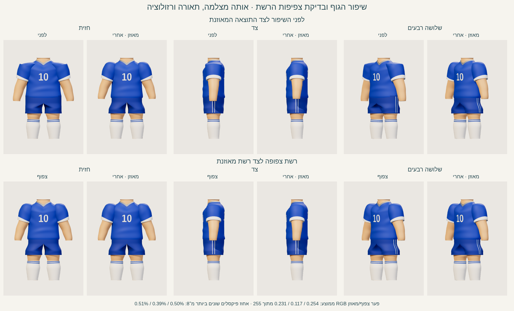

# מעבדת גוף ובגדי הילד — יומן לימוד

זו מעבדה עצמאית ב־three.js. כל הקוד, ספריית הרינדור, כלי הצילום והמסירה נמצאים בתוך `codex-lab/kid-body/`. אין חיבור לאפליקציה ואין שינויים ב־`workout/`, באתר באקה סאן, במעבדת הראש או בקובצי הרפרנס.

נבנו גו, צוואר, זרועות עד שורש כף היד ורגליים עד הקרסול, חולצה עם צווארון V ושרוולים, 10 מלפנים ומאחור, מכנס קצר וגרביים. הראש, כפות הידיים והנעליים אינם נבנים כאן. שני צבעים לבחירה: כחול/לבן ואלמוג/שמנת עם מכנס כחול־ירוק.

## פיקסלי היעד וההשוואה

**הייתה לי גישה לפיקסלים המקוריים של שלושת קובצי היעד.** צפיתי בקבצים ישירות מתוך `../ref/`: גיליון המבטים, גיליון ההבעות ודף הידיים/הנעליים. גיליון המבטים הוא המקור לפרופורציות הגוף ולבגדים; שני הקבצים האחרים עוזרים להבין את חומר הצעצוע ואת הצווארון והגרב.

המקור לגיליון ההשוואה הוא `../ref/מבטים - ילד מדף התלבושות.png (1).png`, בגודל 1254×1254. SHA-256: `c25850f5f3cbc53d2309e7779485868e710b12511b725787a44ca5463d4821b6`. לא הוחלפו צבעי המקור ולא צוירה תמונת יעד מחדש. Playwright טען את הקובץ המקורי; פעולת canvas בגיליון רק חותכת וממקמת תמונות.


החיתוך האנכי הוא Y=518–884, בקירוב צוואר–קרסול. חיתוכי העמודות הם X=15–310, 330–610, 620–915 ו־935–1240. המודל מיושר לאותו גובה באמצעות הקרנת נקודות הצוואר והקרסול, והרוחב נשמר באותו יחס; אין מתיחת צללית כדי לייצר התאמה. בקצוות החיתוך יכולים להופיע פיקסלים של צוואר/קצה נעל; כפות הידיים נשמרות במקור ומופיעות בו בלבד.

**העמודה הרביעית במקור היא חזית חוזרת, לא שלושה רבעים.** היא עומדת ליד חזית חוזרת של המודל. צילום [שלושה רבעים](shots/three-quarter.png) קיים בנפרד, בלי להמציא יעד מקביל. הגיליון מציין זאת במפורש. ה־10 אינו בתמונה המקורית; הוא נוסף לפי התדריך.

## הפעלה ושחזור

1. פתחו את [התיקייה](.) ובטרמינל עברו ל־`codex-lab/kid-body/`.
2. התקינו את כלי הצילום בלבד:

```sh
npm ci --cache ./work/npm-cache --no-audit --no-fund
```

3. הפעילו את המעבדה:

```sh
npm run serve
```

4. פתחו את הכתובת שהשרת מדפיס. ברירת המחדל:

```text
http://127.0.0.1:8766/
```

5. בחרו מבט, צבע ושלב. התוצאה הרצויה: הגוף מוצג בשלמותו בלי ראש, כפות ידיים או נעליים; 10 נקרא בשני הצדדים. לחיצה על שלושת השלבים משנה את הגאומטריה, כשהמצלמה והאורות נשארים באותו מקום.
6. לצילום ולמדידה:

```sh
npm run capture
```

הצילום משתמש ב־Chromium מקומי. אם הנתיב שונה:

```sh
CHROMIUM_PATH=/path/to/chromium npm run capture
```

הסקריפט מפעיל וסוגר שרת בעצמו. לבדיקה ידנית של חיתוך נטול ממשק:

```text
http://127.0.0.1:8766/?capture=1&view=front&stage=final&palette=blue
```

`index.html` הוא הדף היחיד. הוא מייבא `scene.mjs`, שמייבא `model.mjs` ו־`vendor/three.module.js` המקומי, revision 160. עותק הספרייה נלקח מהעותק המקומי הקיים במעבדת הראש; מצורף רישיון MIT ב־`vendor/LICENSE`. אין CDN, פונט רשת, מודל חיצוני או תלות npm בזמן הצגת הדף. npm נחוץ רק לצילומים האוטומטיים. קובצי השרטוט ו־NOTES זמינים גם בלי npm; לצפייה ב־ES modules יש להפעיל שרת HTTP.

## מצלמה, תאורה ותנאי המדידה

המצלמה אורתוגרפית: מיקום `(0,0.875,6)`, מבט אל `(0,0.875,0)`, גובה מסגרת 2.12, near=0.1, far=30. רוחב מינימלי 1.34 שומר על הזרועות בתוך מסגרת צרה של טלפון. המסגרת תלויה רק ביחס המסך: `height=max(2.12,1.34/aspect)`. אין התאמה מחדש לפי מודל, שלב או מבט. תנאי המסגרת בפועל נרשמים ב־JSON. המבטים נקבעים על ידי סיבוב הילד בלבד: 0°, −90°, −180° ו־−45° סביב Y.

| אור | מיקום | צבע | עוצמה |
| --- | --- | --- | ---: |
| ראשי | −3,4.5,5 | `#fff2e1` | 3.10 |
| מילוי | 3,2,3 | `#e3edff` | 1.35 |
| אחורי | 1,3,−4 | `#fff5e5` | 2.00 |
| Hemisphere | שמיים / קרקע | `#fff5eb` / `#9da8be` | 1.00 |

ACES filmic, exposure=1, פלט sRGB, רקע `#eae7e2`. צל PCFSoft במפה 1024², bias=−0.0005, normalBias=0.018. מפת הצל מתעדכנת בשינוי המודל/מבט; הפריים עצמו ממשיך להירנדר ב־requestAnimationFrame. החלופות המבריקה והשטוחה משתמשות באותה תאורה ומצלמה.

## המדידות שנאספו בסבב הנוכחי

נמדד ב־Chromium **151.0.7922.173**, עם Playwright **1.57.0 בפועל**, במסך **390×844 CSS pixels, DPR=2**, כלומר buffer של **780×1688**. `package-lock.json` מצמיד את כלי השחזור ל־Playwright 1.56.1; בריצה הזאת נעשה שימוש בעותק 1.57.0 המקומי, והגרסה בפועל נשמרה ב־JSON. הרינדור הוא SwiftShader בתוכנה; זו **אינה מדידה על טלפון פיזי**. לכן אין להסיק ממנה FPS של GPU בטלפון.

| גרסה ושלב | משולשים במודל | קריאות ציור בפריים הראשי | זמן יצירת מודל חציוני, ms | FPS | פריימים | זמן חלון בפועל, שניות |
| --- | ---: | ---: | ---: | ---: | ---: | ---: |
| נפחים בסיסיים `blockout` | 6,864 | 14 | 2.65 | 5.10 | 26 | 5.100 |
| מעטפת מעוצבת `shaped / balanced` | 25,280 | 42 | 14.25 | 2.59 | 14 | 5.400 |
| קפלים וגימור `final / balanced` | 25,280 | 42 | 14.60 | 2.19 | 11 | 5.017 |
| קפלים וגימור `final / dense` המעודכן | 59,920 | 42 | 31.65 | 1.70 | 9 | 5.300 |
| הבסיס המקורי, נמדד מחדש בסבב זה | 59,920 | 124 | 31.50 | 1.37 | 7 | 5.100 |

הבסיס נלקח מהקוד המקורי שב־commit `ef6e17d5b6312ede14750275ac273c98903b092f`, לפני שינויי סבב ההמשך, וצולם באותה מסגרת. hash של שלושת קובצי המקור נשמר ב־[מדידות הבסיס](shots/optimization/baseline-metrics.json). נוסף לו hook לקריאת מונה הרינדור בלבד; המודל, קבוצות החומר, התאורה והמצלמה לא הוחלפו. בתיעוד הקודם דווח 1.21 FPS לגימור; זהו נתון היסטורי מריצה אחרת, והוא אינו תוצאת הבסיס שנמדד מחדש כאן, 1.37 FPS.

זמן בנייה פירושו כאן זמן יצירת הגאומטריות, החומרים והטקסטורות בדפדפן, ולא שעות עבודת המפתח. בכל שלב נבנו 20 עותקים מחדש; חציון וזמני כל הדגימות נשמרו. הרינדור של דגימות הביניים נדחה, כדי למדוד בנייה בלי להעלות 20 גרסאות ל־GPU. זמן `rebuildWallTimeMs` הנוסף כולל פינוי העותק הקודם והכנסה לסצנה. זמן העלאה ל־GPU אינו נכלל בטענה על זמן בנייה.

FPS נמדד בדף רינדור פעיל אחד, לאחר חימום של 1 שנייה ובחלון מבוקש של 5 שניות. הזמן בפועל, מספר הפריימים, חציון זמן פריים ו־p95 נשמרו. דף הצילומים נסגר לפני המדידה כדי שלא יתחרה ברינדור הטלפון. נבדק גם רצף ארוך יותר ל־`final / balanced`: **2.15 FPS**, עם **23 פריימים ב־10.6995 שניות**, לאחר חימום נוסף של שנייה. חציון זמן פריים ברצף זה היה 416.6ms ו־p95 היה 1283.3ms. גם המדגם הארוך מציג רינדור תוכנה איטי; זו ראיה להשוואת הגרסאות בסביבה הזאת, ולא הבטחת ביצועים.

ספירת המשולשים היא ספירת הטופולוגיה פעם אחת לכל mesh. היא כוללת גם גו/גפיים שמכוסים בבגד, ואינה מספר המשולשים שנשלחים בכל מעברי הצל/החומר ל־GPU. האולפן מוסיף שני משולשים של רצפה. הקפלים משנים קודקודים קיימים ולכן אינם מעלים את הספירה ביחס ל־shaped. קריאות הציור נלקחו מ־`renderer.info.render.calls` אחרי רינדור מפורש; זהו מעבר הסצנה הראשי בלבד, ללא מעברי הצל. מפות הצל נשמרות בזמן מדידת FPS.

הנתונים המלאים: [metrics.json](shots/metrics.json), [מדידות השיפור והצפיפות](shots/optimization/metrics.json), [capture.json](shots/capture.json), [reference.json](reference.json). לא נעשה שימוש במדידה משוערת במקום בדפדפן.

## ראיות לפני ואחרי


כל שלושת הצילומים בגיליון הזה נוצרו באותה ריצה, ב־420×600 וב־DPR=1. `blockout` הוא אב־טיפוס אמיתי: גם חדירת הרגל דרך גרב הגליל נשמרה כדי להסביר למה נדרש פרופיל עוטף. `shaped` הוא בגד ללא שדות הקפל; `final` מוסיף אותם ואת גימור החומר.

תמונות האבחון מן הניסיונות המוקדמים נשמרו בנפרד, בתצוגת האולפן הישנה 584×650: [חזית ראשונה](shots/first-front.png), [צד ראשון](shots/first-side.png), [¾ ראשון](shots/first-three-quarter.png). הן מראות שרשרת טבעות, חורי כתפיים וצל מלבני במכנס. [חדירת הגו לצווארון](shots/experiments/neck-intersection.png) ו־[חדירת ירך בצד](shots/experiments/side-intersection.png) נשמרו גם הן. אלה תמונות אבחון, לא השוואה כמותית באותו גודל מסך. ניסויי המספר והחומר הסופיים מצולמים ב־420×600: [מספר שטוח](shots/experiments/flat-numbers.png), [חומר מבריק](shots/experiments/glossy.png).

## טכניקות ופרמטרים

לכל שיטה להלן מתועדים הפעולה, הפרמטרים, הסיבה, המצב לפני/אחרי והניסיון שנפסל. כשחלופה לא נבדקה, זה כתוב במפורש; אין ייחוס תוצאה לניסוי שלא נעשה.

## 1. יחידת ראש, נקודות ציון ומיפוי אנכי

ראש השיער–סנטר בתמונה הוא בערך 250 פיקסלים; צוואר–קרסול בערך 370. לכן הגובה של החלק שנבנה כאן הוא 1.50 יחידות ראש. ביחד עם ראש ועם מרווח נעל של 0.15, גובה הדמות המתוכנן הוא 2.65 ראשים. הראש והנעל הם יחידות מדידה בלבד ואינם מוצגים במודל.

המידות הסופיות: קרסול 0.10, קצה גרב 0.46, מכפלת מכנס 0.57, מותן/מכפלת חולצה 0.856, כתף 1.49, ראש צוואר 1.60. זרועות מקבלות מיפוי נפרד: נקודת שורש כף היד במערכת העבודה y=0.79 ממופה ל־0.84, במקום 0.80 בגרסה הקודמת. זו נקודת הציר; הקצה בפועל הוא חתך מוטה ולכן אינו כולו בגובה אחד. כל המספרים ביחידות ראש. בריצת הבסיס רוחב הגוף הטיפוסי לפני הבגד היה 0.54–0.59; חולצה 0.61–0.66. בסבב הנוכחי רדיוס X של החולצה מוכפל ב־0.90 עד אזור הכתף; ההכפלה דועכת חזרה ל־1 דרך `smooth(1.49,1.58,y)`, כדי לשמור את המפתח המקורי ליד הצוואר. הגו הפנימי עוקב אחריה. הפנייה קדימה היא ‎+Z, וגובה הוא ‎+Y.

לפני: נבנתה מערכת עבודה שבה הצוואר הגיע ל־1.67 והקרסול ל־0.08, כלומר גוף 1.59 ראשים. אחרי: נאפו נקודות הציון האנכיות לתוך הקודקודים, בלי לשנות את המצלמה. המיפוי מקצר את הרגליים ביחס לגו ולזרועות. מערכת העבודה הראשונית ארוכה יחסית לפיקסלים של היעד; זו השוואת פרמטרים לפני אפייה, ולא צילום של דמות נוספת בגובה 1.59. תיקון אחיד של כל הגובה היה מקצר גם את הזרועות; לכן נקבע להן מיפוי נפרד.

## 2. גו ובגד כחתכים מחוברים

החולצה היא רשת loft עם רדיוסים משתנים. בגרסת `dense` יש 64 חלוקות סביב הגוף ו־58 לאורך הגובה; ב־`balanced` יש 32×32. חתכי העבודה המרכזיים `(y,rx,rz)` הם `(0.918,0.320,0.197)`, `(0.948,0.331,0.203)`, `(1.04,0.316,0.196)`, `(1.19,0.304,0.195)`, `(1.34,0.308,0.203)`, `(1.44,0.319,0.195)`, `(1.49,0.281,0.160)`. אלה נקודות לפני מיפוי הגובה הסופי ולפני צמצום רדיוס X פי 0.90. בחלק העליון יש מעבר רך לרדיוס הצוואר `(0.132,0.112)` בין 1.36 ל־1.58. הצמצום הרוחבי דועך ל־1 בטווח 1.49–1.58, כך שרדיוס הצוואר המקורי נשמר והעור אינו חותך דרך הרצועה הלבנה. ה־loft יוצר בטן מעט מלאה ומותן מעט צרה, כך שהבגד נראה כמו מעטפת צעצוע.

הגו שבתוך החולצה הוא גרסה קטנה של אותו משטח: ‎X×0.89, ‎Z×0.88 והנמכה של 0.01. כך הוא משאיר עובי לבגד ואינו חותך דרך שקע ה־V. הוא אינו מטיל צל על הבגד שמכסה אותו.

לפני: נפחי `blockout` הם כדורים מתוחים וצילינדרים. אחרי: `shaped` משתמש בחתכים מחוברים, ו־`final` מוסיף שדות קפל וגימור חומר. ניסוי גו עם קצה עליון אופקי יצר פס עור ישר על החזה כשהחולצה עוצבה עם V; רואים אותו בצילומי הניסיון הראשון וב־v4. צורת הגו הפנימית הוחלפה כדי לעקוב אחר הצווארון. אין כאן הוכחה שהשיטה מתאימה לגוף עירום: המודל הפנימי נבנה למעטפת הבגד הזאת.

## 3. זרוע, שרוול ורגל: מסלול עם אינטרפולציה חלקה

הזרוע היא mesh אחד משורש כף היד ועד הכתף. הקצה העליון המכוסה בשרוול נעצר בגובה עבודה 1.38, כדי שהעור לא יצא מעל כיפת השרוול. נקודות הבקרה של הציר עוברות בקירוב דרך `(x,y)=(0.496,0.790),(0.465,0.960),(0.441,1.065),(0.387,1.190),(0.263,1.445)` לפני מיפוי הגובה. רדיוס הזרוע נע מ־0.065 בשורש כף היד לכ־0.12 בכתף. בסבב הנוכחי קואורדינטת X המתקבלת, כולל מיקום הציר ורדיוס החתך, מוכפלת ב־0.95 בזרוע ובשרוול; עומק Z וגובה Y נשמרים. טבעות החתך ניצבות למשיק של המסלול; לכן הזרוע אינה ערימה של כדורים. יש 48 חלוקות סביב כל גפה ב־`dense`, ו־32 ב־`balanced`. הקצה בשורש כף היד הוא משטח חיבור שטוח, ללא כף יד.

לשרוול חתכים נפרדים והוא חופף לכתף. בגרסה הקודמת הכיפה נסגרה מרדיוס X=0.135 בגובה עבודה 1.446, דרך 0.080 בגובה 1.469 ומרכז X=0.221, עד 0.001 בגובה 1.486 ומרכז X=0.184. בנוסף, מעל 1.35 הוקטנה נטיית החתך בהדרגה עד שהתיישר ב־1.446. הסגירה המהירה והיישור יצרו כתף שטוחה ורכס בחיבור. כעת הכיפה מצטמצמת בטווח רחב יותר: חתכי `(y,x,rx,rz)` הם `(1.31,0.343,0.137,0.145)`, `(1.36,0.318,0.134,0.144)`, `(1.405,0.296,0.121,0.136)`, `(1.446,0.276,0.094,0.112)`, `(1.469,0.265,0.064,0.081)`, `(1.486,0.257,0.001,0.001)`. שיפוע המסלול נשמר לאורך כל הכיפה, ללא יישור מאוחר. הפרמטרים האלה קודמים למיפוי הגובה ולצמצום X פי 0.95. הפס הלבן גבוה 0.035, ורשת שפה קצרה מחברת את החוץ לפנים ליד הזרוע.

לרגל יש ציר קצר ורדיוסים 0.092 בקרסול ו־0.117 בברך. רדיוס הירך הראשון, 0.142, חדר דרך האגן המשותף ויצר שני משולשי עור בגב המכנס; הוא הוקטן בבסיס ל־0.126 לרוחב ו־0.121 לעומק. בסבב הנוכחי, לאחר צמצום מותן המכנס, החתך המכוסה בגובה y=0.84 הוקטן שוב ל־0.105 לרוחב ו־0.119 לעומק, כדי שהירך לא תחדור דרך המותן החדשה. הברך החשופה אינה משתנה בגלל תיקון החלק המכוסה. הרגל מסתיימת במשטח הקרסול ולא בכף רגל.

לפני: interpolation מסוג smoothstep בכל מקטע איפס את שיפוע המסלול בכל נקודת בקרה. זה יצר טבעות וכיפופים שנראו כמו שרשרת חלקים, בעיקר בשרוול ובמרפק. אחרי: Hermite עם שיפועים משותפים לשני המקטעים הסמוכים נותן מעבר C1 לאורך המסלול ולרדיוסים. הצילומים הראשונים מראים את התוצאה שנפסלה; תמונות v3 ומעלה מראות זרוע רציפה. שרוול שנשאר פתוח בחלק העליון יצר חור כהה מעל הכתף; הארכת ה־loft לכיפה סגרה אותו. שרוול ללא שפה פנימית השאיר מרווח חד ליד פס הסיום; נוספה שפה לבנה ברוחב המרווח.

## 4. צווארון V בתוך הגאומטריה

הפתח בחולצה עצמו מקבל שקע קדמי; הצווארון הלבן עוקב אחר הפתח כרצועה טבעתית ולא כטורוס נפרד. עומק ה־V במערכת העבודה הוא 0.118. פרופיל ‎|X| מעוגל בסביבת המרכז באמצעות `sqrt(cos²(theta)+0.0025)`, כדי להשאיר V בלי פינה חדה. ברצועה הסופית נדגמים פני החולצה עצמם: פרמטר הגובה יורד מ־1.58 עד 1.537, כלומר טווח עבודה 0.043. ההבלטה מעל הבגד היא 0.0015 ועיגול השפה 0.0008. הרצועה הראשונה הורחבה בנפרד ב־0.027 והונמכה ב־0.026; היא חתכה את החולצה ויצרה שיניים לבנות זעירות. דגימה חוזרת של אותו משטח החליפה אותה. בצווארון יש 80 חלוקות סביב ו־6 לרוחב ב־`dense`, ו־48×6 ב־`balanced`.

לפני: שקע V הוכנס רק לטבעות בגבהים 1.44–1.58. smoothstep בטווח הצר גרם לטבעות לרדת חזרה זו על זו; גם שינוי לינארי בטווח זה השאיר מדף כמעט אופקי ליד החזה. אחרי: עומק השקע נפרש באמצעות smoothstep מ־1.24 עד 1.58; שיפועו המרבי נמוך מ־1 ולכן הגובה עולה לאורך ה־loft. מעבר הרדיוסים אל הצוואר מתחיל כבר ב־1.36. שקע המבוסס רק על `sin(theta)` נתן צורת U בחזית; פרופיל ‎|X| המעוגל מחליף אותו ב־V.

## 5. מכנסיים קצרים: שני פתחים ואגן משותף

כל רגל של המכנס מתחילה בחתך אליפטי: מרכז ‎X=±0.181, רדיוס ‎X=0.155, רדיוס עומק 0.179. בגרסה הקודמת החתך הפך לחצי אגן בין גובה עבודה 0.735 ל־0.837, ברוחב עליון כולל 0.668. בסבב הנוכחי המעבר מתפרש בין 0.705 ל־0.86, והחתך העליון הוא `0.282*max(0,cos(theta))`, ברוחב כולל 0.564. עומק האגן נשאר 0.197; שני פתחי הרגל נשארים רחבים. שתי המחציות נפגשות לאורך חזית וגב האגן המרכזי, והקירות הפנימיים נשארים באזור המכוסה. מכפלת כל רגל נשארת נפרדת. הרשת אינה cloth simulation ואינה מיועדת לאנימציה בשלב הזה.

נוסה בסבב זה חצי חיובי מעוגל: `(c+sqrt(c²+0.012))/(1+sqrt(1.012))`, כאשר `c=cos(theta)`. הוא נועד לרכך את שינוי הנגזרת, אך הרדיוס החיובי שנשאר גם בחלק הפנימי הרחיק את שתי המחציות ויצר חריץ במרכז. רואים זאת ב־[ניסוי המפשעה המעוגלת](shots/experiments/rounded-cosine-gap.png). הניסוי נפסל; הוחזר `max(0,c)`, והמעבר האנכי הרחב נשמר. ההשוואה הזאת מתעדת כשל שנצפה וצולם, ולא חלופה משוערת.

המכפלת היא פס באותו צבע, גובה 0.014 והבלטה 0.0013. שני פסי הצד דקים: רוחב זוויתי 0.055, סביב ‎theta=±0.11, והבלטה 0.0018 מעל המשטח.

לפני: במראה הראשון היה מלבן צל שחור וחד בירך השמאלית. אחרי: בצד שמאל שיקוף הקודקודים הפך גם את כיוון המשולשים. תיקנתי את סדר האינדקסים, ומפות הצל משתמשות בפאה החיצונית `FrontSide`. הצילומים v4 מוכיחים שהמלבן נעלם. DoubleSide עדיין מאפשר לראות שפות בגד פנימיות, אבל אינו תחליף לכיוון משולשים נכון. סימון המספרים נעשה על משטח נפרד ואינו אחראי לתיקון הזה.

## 6. קפלים רכים כשדות גאוסיאניים

השינוי הוא בקודקודים, לא בקווים כהים. בבתי השחי יש זוג בליטה ושקע רחבים: בליטה 0.012 ברוחב אנכי 0.044, ושקע 0.006 ברוחב 0.035, ממוקמים סמוך ל־‎|X|=0.265. במותן: בליטה 0.009 ברוחב 0.035 ושקע 0.004 ברוחב 0.036, בקו משופע קלות. במכנס: נפח רך 0.005 ושקע 0.0025. בגרסה הקודמת הברך קיבלה בליטה קדמית 0.006 ברוחב 0.05 ושקע אחורי 0.0035 ברוחב 0.026; בסבב הנוכחי אלה הוחלפו בבליטה 0.003 ברוחב 0.07 ושקע 0.0018 ברוחב 0.045. הפחתת המשרעת והרחבת השדה מרככות את הדחיסה במקום ליצור פס צר. בשרוול השינוי הרחב הוא 0.004 ופחות ממנו בשקע הסמוך.

לפני: `shaped` עם אותה צללית ואותו לבוש נותן משטחים אחידים. אחרי: `final` מכניס גוונים הדרגתיים באמצעות אור וצל, בעיקר במותן ובבתי השחי; הברך מקבלת נפח קטן. החלופה שנבדקה היא הבגד החלק של shaped: הוא שומר את הצללית, אבל אינו מראה את דחיסת הבגד במותן ובבית השחי. לא בוצע ניסוי נפרד בקפלים חדים או מוגזמים, ולכן אין טענה שהשוואה כזאת נבדקה. הכשל שראינו בטבעות הזרוע היה כשל באינטרפולציית הציר, לא תוצאת שדה הקפל.

## 7. גרביים ופסים מחומר אחד לרשת אחת

כל גרב היא loft עבה בעל 48 חלוקות רדיאליות ב־`dense`, ו־32 ב־`balanced`. הרדיוס עולה מכ־0.096 בקרסול ל־0.130 במרכז השוק וחוזר ל־0.116 בקצה העליון. שני פסים משויכים לקבוצות משולשים באותה רשת בגבהי עבודה 0.438–0.450 ו־0.469–0.481. מוסיפים את גבולות הפסים לרשימת החתכים כדי לקבל גבול נקי ושני צבעים על גאומטריה רציפה. זה מונע צורך בטבעות צבע עצמאיות מעל הגרב. בסבב ההמשך אוחדו קבוצות סמוכות שמשתמשות באותו חומר: במקום 46 קבוצות לכל גרב בבסיס, מתקבלות 5 קבוצות רציפות, בלי לשנות את הפסים או את צבעיהם. גרב ה־blockout היא צילינדר ישר; גרב ה־shaped מקבלת שוק תפוחה ותפר סיום מעוגל. בנפחי הבסיס, גליל הגרב לא כיסה את אליפסת השוק, ונחשפו כתמי עור דרך הגרב. זה מופיע בצילום blockout שבגיליון לפני/אחרי. פרופיל העוטף את השוק החליף אותו. לא נוסתה גרסת פסים עצמאית ולכן אינה מוצגת כניסיון שנכשל.

## 8. מספר 10, טקסטורה מקומית ונורמלים

Canvas מקומי בגודל 512×512 יוצר `10` בלבן, במשקל 900 ובגודל 345px. אין בקשת רשת לפונט. המדבקה אינה מלבן שטוח: 18×18 תאים ב־`dense`, או 12×12 ב־`balanced`, דוגמים את פני החולצה ואת שדה הקפל. בחזית המידות 0.251×0.255, ובגב 0.268×0.283, לפני מיפוי גובה. בסבב ההמשך חישוב `acos` של זווית הדגימה משתמש ב־`jerseyRadii(y)`, אותה פונקציה שמצמצמת את החולצה, כדי לשמור על רוחב המספר ולהצמידו למשטח המעודכן. הבלטה 0.0011 ו־polygonOffset מקטינים חפיפת עומק. UV בגב משוקף כדי שהמספר ייקרא מן הגב. צבע הטקסטורה מוגדר sRGB.

לפני ואחרי: ב־blockout אין מספר; ב־shaped וב־final מופיעים שני המספרים. בוצע גם ניסוי מדבקה שטוחה: Z קבוע ±0.198 במקום דגימת פני החולצה. רואים חיתוך של המספר אל תוך החזה ב־[ניסוי המספר השטוח](shots/experiments/flat-numbers.png); הוא נפסל. אפשר לשחזר עם `?capture=1&view=threeQuarter&experiment=flat-numbers`. אין נכס תמונה חיצוני למספר. `computeVertexNormals()` אחרי אפיית מיפוי הגובה דרס את איחוד הנורמלים בקו ה־UV הכפול; איחדתי אותם שוב אחרי האפייה. גם מיפוי הגובה הסופי עבר מ־linear בכל מקטע ל־Hermite עם משיקים משותפים, כדי ששיפוע השפה בכתף לא יקפוץ בנקודות הציון. התיקון מסיר פס תאורה לאורך התפר הטכני של ה־loft.

## 9. חומר צעצוע, צבע וקביעות

שתי ערכות: כחול מלכותי ומכנס כחול כהה; אלמוג ומכנס כחול־ירוק. צבע העור זהה. חולצה roughness 0.65, מכנס 0.69, עור 0.52, trim 0.70; metalness תמיד 0. `final` מקבל clearcoat קטן 0.085 בבגד ו־0.055 בעור, עם roughness 0.72 של הציפוי. טקסטורת bump מקומית 128×128, ללא מקריות משתנה, והגובה שלה 0.00045 בלבד. המטרה היא פיזור קטן של אור על צעצוע, בלי weave ריאליסטי. כל כפתור שמחליף שלב משחרר את הגאומטריות, החומרים והטקסטורות הקודמים.

ה־blockout וה־shaped משתמשים בחומר פשוט יותר ללא bump וללא clearcoat. בוצע בסצנה ניסוי מבריק: roughness=0.08, clearcoat=0.70 ו־clearcoatRoughness=0.08, ללא bump. הוא יצר היילייטים חדים ומראה פלסטיק מבריק, בעיקר על הזרועות והחזה, ולכן נפסל לטובת החומר הרך. ראו [ניסוי מבריק](shots/experiments/glossy.png); לשחזור `?capture=1&view=front&experiment=glossy`. המצלמה והתאורה נמצאות ב־scene.mjs ונותרות זהות בשלושת השלבים, כדי שהשוואת המודל תישאר ניתנת לבדיקה.

## אימות וגבולות התוצאה

- בסבב הנוכחי Playwright עבר ארבעה מבטים, שתי ערכות, שלושה שלבים, שתי צפיפויות, צילום טלפון והשוואה למקור. הכפתורים נלחצו ונבדקו גם בדף מחשב וגם בגודל טלפון; 16 בדיקות בקרה עברו. כל החלקים הנדרשים נמצאו; לא נמצאו ראש, כף יד, נעל או כף רגל. נרשמו **אפס שגיאות, אפס אזהרות דפדפן ואפס בקשות רשת חיצוניות**, כפי שמופיע ב־`capture.json`.
- השרת מגיש רק את המעבדה ואת קובצי PNG של `../ref/` לקריאה. אין route ליישומים האחרים. בסבב הנוכחי הורצו בדיקות המעבדה ובדיקות תחביר של המודולים שבתחומה.
- בריצת הבסיס הקודמת הורץ גם `npm test` של המאגר: **51/52 עברו**. זו ראיה היסטורית, לא בדיקה שהורצה בסבב הנוכחי. הכשל שנרשם אז היה `tests/lang.test.mjs`, תת־בדיקה `commands in three languages`: משימת יום חמישי החזירה 15.10.2026 במקום 8.10.2026. הטסט משתמש ב־`new Date()` בזמן שהציפייה בו קבועה. קובצי הטסט, `commands.js` ו־`travel.js` תועדו אז כזהים לבסיס `f1fff61`. בדיקות יתר המאגר לא הורצו שוב בסבב הנוכחי, שעוסק רק במעבדה.

מה נותר: הצללית עדיין אינה התאמה פיקסלית מושלמת ליעד. הכתף המעודכנת רכה יותר, אך חיבור השרוול לגו עדיין נקרא כמעבר בין מעטפות נפרדות; צורת המפשעה והתרחבות המכנס אינן זהות למקור, ועומק החולצה במבט צד קטן מעט. הכתפיים והברכיים תוקנו בסבב ההמשך המתועד להלן. הקפלים סטטיים, והמודל מורכב ממעטפות חופפות ולא מרשת אחת מוכנה להנפשה. נוספה צפיפות קבועה נמוכה יותר, אך לא נעשה LOD דינמי ולא בוצעה בדיקת GPU בטלפון פיזי. אלה מגבלות המעבדה הנוכחית. ראש, כפות ידיים ונעליים אינם חוסרים במשימה — הם מחוץ לתחומה. אין צילום יעד של שלושה רבעים במאגר.

## סבב המשך: יחסים, כתפיים וקפלים

המעבדה והניסויים המתועדים למעלה כבר היו קיימים בתחילת סבב זה. התיעוד המקורי נשמר כי הוא מסביר את הדרך אל הבסיס ואת הכשלים שכבר צולמו; ערכי הצפיפות והפרמטרים שהוחלפו מסומנים כ־`dense` או כגרסה קודמת. סבב ההמשך התחיל מצפייה ישירה בשלושת קובצי היעד ובצילומי המעבדה הקיימים. הוא אינו מתואר כבנייה מחדש מאפס.



בגיליון זה כל צילום מקור נלקח ב־420×600 וב־DPR=1. השורה העליונה משווה את הקוד המקורי לגרסה המעודכנת; השורה התחתונה משווה שתי צפיפויות של אותה גרסה מעודכנת. המצלמה, התאורה, החומר והצבעים זהים בין הזוגות. כך אפשר להפריד בין שינוי צורה לבין מחיר דגימת המשטח.

לפני ואחרי בכתף: ב־[חזית הבסיס](shots/optimization/baseline-front.png) הקצה העליון של השרוול כמעט אופקי, עם פינה חיצונית בולטת. ב־[החזית המעודכנת](shots/optimization/balanced-front.png) הוא קמור ויורד לכיוון הפס הלבן; החזה צר יותר וקצה האמה עלה מעט. [מבט הצד המעודכן](shots/optimization/balanced-side.png) ו־[שלושה רבעים המעודכן](shots/optimization/balanced-threeQuarter.png) מראים את הכיפה הקמורה גם בעומק. חיבור השרוול לגו עדיין מורכב משתי מעטפות חופפות, ואינו רשת אחת מולחמת.

| טכניקה | לפני | הפעולה והפרמטרים הנוכחיים | למה |
| --- | --- | --- | --- |
| רוחב הגו והזרועות | הגו נראה רחב וריבועי; הזרועות נפתחו יותר מן היעד וקצה האמה היה נמוך | רדיוס X של החולצה ×0.90, עם חזרה ל־1 בטווח 1.49–1.58 ליד הצוואר. X של הזרוע והשרוול ×0.95, כולל מרכז הציר; נקודת שורש כף היד ממופה מ־0.79 ל־0.84. עומק הגו והזרועות נשמר | לקרב את יחסי הגו ופתיחת הזרועות לפיקסלי היעד, לשמור את המפתח ליד הצוואר ולהעלות מעט את קצה האמה |
| כתף וכיפת שרוול | כיפה שנעלמה בתוך טווח קצר, ויישור מאוחר של שיפוע החתכים, יצרו גג שטוח ורכס בחיבור | הוספת חתכים מתכווצים החל מ־y=1.31; רדיוס X יורד בהדרגה .137→.134→.121→.094→.064→.001. שיפוע המסלול נשמר עד סגירת הכיפה | ליצור כתף שיורדת בקשת, במקום חלק שנראה מודבק לגו |
| קפל ברך | בליטה .006 ורוחב .05; דחיסה אחורית .0035 ורוחב .026 | בליטה .003 ורוחב .07; דחיסה אחורית .0018 ורוחב .045 | להפוך צל צר לדחיסה רחבה ורכה, עם דגש על החלק האחורי של הברך |
| מפשעה ואגן | מעבר .735–.837 ורדיוס מותן .334 יצרו אגן רחב ורכס ליד המפשעה | מעבר .705–.86 ורדיוס עליון .282. נשמר `max(0,c)` לאחר שניסוי `sqrt(c²+.012)` יצר חריץ ונפסל; הירך המכוסה בגובה .84 צומצמה לרדיוס X=.105 | להרחיב את ההשתלבות באגן ולהצר את המותן, תוך שמירה על מפגש מרכזי וללא חדירת הירך לבגד |

אלה שינויים של צורה ושל דגימת המשטח, ללא סימולציית בד. גרסת הכיפה הקודמת אינה ניסיון מומצא: היא נראית בצילומי המבטים שהיו בתחילת העבודה. לא בוצעה כאן סדרת ניסויים נפרדת שמבודדת כל שינוי; שינוי הכתף, צמצום הרוחב וריכוך הקפלים נעשו באותו סבב, ולכן אין לייחס שיפור מצולם אחד לפרמטר יחיד בלבד. הניסיון הנוסף במפשעה כן צולם ונפסל בגלל החריץ במרכז; הוא מתועד בסעיף 5. הפרק מתעד את הגרסה הקודמת ואת הפעולה שבוצעה, והגיליון מציג את ההשוואה המצולמת.

נוסף גם preset של צפיפות קבועה `balanced`: הוא מפחית חלוקות לאורך משטחים רחבים ומשאיר דגימה קרובה יותר באזור הברך החשופה ובגבולות פסי הגרב. `dense` נשאר לבדיקת אותה צורה בצפיפות הקודמת: 59,920 משולשים במודל, לעומת 25,280 ב־`balanced`, הפחתה של 57.8%. בנוסף, איחוד קבוצות החומר בגרב הפחית אותן מ־46 ל־5 לכל גרב; כלל קריאות הציור במעבר הראשי ירד מ־124 בבסיס ל־42. אלה החלטות ביצועים; הן אינן אחד משלושת הגורמים לדירוג הרמה החזותית להלן. זמני הבנייה וה־FPS שנמדדו מופיעים בטבלה למעלה.

לפני ואחרי בצפיפות: גם `dense` וגם `balanced` משתמשים בצורה המעודכנת. ההבדלים ביניהם נמדדו ישירות בתמונות, בלי יישור, שינוי גודל, צביעה או עיוות. המדד הוא ההפרש המוחלט הממוצע של ערכי RGB בטווח 0–255. הוא אינו מדד התאמה לתמונת היעד.

| מבט | הפרש RGB ממוצע, מתוך 255 | פיקסלים שבהם ערוץ כלשהו השתנה ביותר מ־8 | חפיפת מסכת צללית מקורבת, IoU |
| --- | ---: | ---: | ---: |
| חזית | 0.25443 | 0.4984% | 0.99782 |
| צד | 0.11686 | 0.3944% | 0.99748 |
| שלושה רבעים | 0.23129 | 0.5119% | 0.99741 |

מסכת הצללית נגזרת מהפרש גדול מ־14 ביחס לצבע הרקע בפינה השמאלית העליונה; היא כוללת גם צל רצפה כהה דיו. לכן זו מסכה מקורבת, לא חלוקה סמנטית של הגוף. בחנתי גם את הצילומים עצמם: הפחתת הצפיפות משאירה את צורת הצעצוע דומה מאוד תחת התאורה והמסגור הקבועים האלה. ההפרש הקטן אינו מוכיח שהמודל מתאים ליעד או שכל זווית אפשרית נשמרת באותה מידה.

## שלוש ההחלטות שהכי העלו את הרמה

1. **יחסים שנקבעו מהפיקסלים של היעד:** גוף של 1.50 ראשים ותכנון כולל של 2.65, רגליים קצרות, וצמצום רוחב הגו ופתיחת הזרועות בסבב ההמשך. היחסים האלה קובעים את מראה הילד עוד לפני החומר והקפלים.
2. **כתפיים ומעברים רכים:** loft עם שיפועים משותפים, כיפת שרוול שמתכווצת לאורך טווח רחב ושומרת את נטיית החתך, ומעברי ברך ומפשעה רחבים. אלה מפחיתים גגות שטוחים, רכסים ואת המראה של חלקים מודבקים.
3. **טופולוגיה ונורמלים תקינים:** V מונוטוני, גו פנימי תואם, סדר משולשים נכון ונורמלים מאוחדים לאורך תפרי UV. הם מסירים חורים, פס עור וצל חד שמסתירים את צורת הצעצוע גם תחת תאורה טובה.
