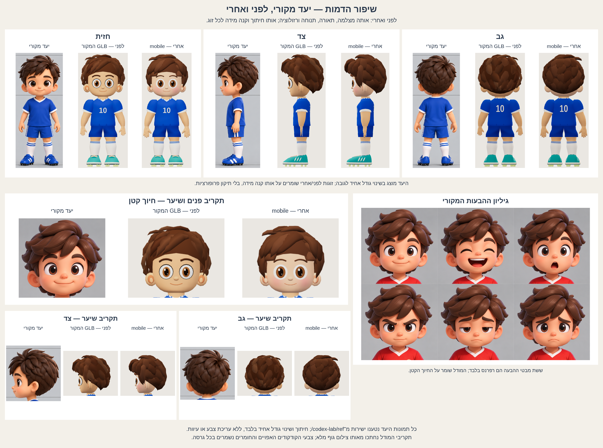
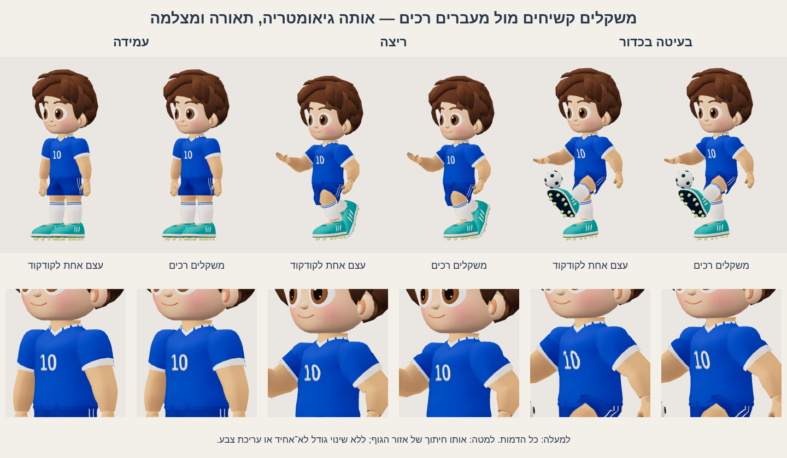
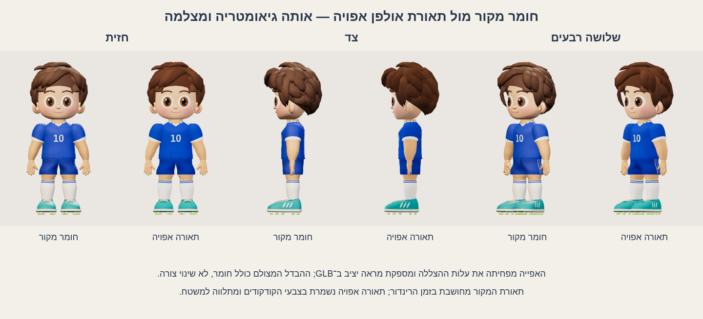

# מעבדת ילד שלם — חיבור, שלד, ייצוא וביצועים

## הסבב הנוכחי — 09.10.2026

הדמות שופרה לפי גיליונות המבטים וההבעות, עם שמירת השלד, שלוש התנוחות וייצוא ה־GLB. כל השינויים מוגבלים ל־`codex-lab/kid-full/`; תיקיות המקור ותמונות היעד נקראו בלבד. `mobile` הוא כעת ברירת המחדל גם במחשב וגם בטלפון.

| עדיפות | מה השתנה | מה עדיין רחוק מהיעד |
| --- | --- | --- |
| 1. שיער | קווצות בחתך מעוגל יותר, שורשים רחבים וקצוות צרים; זרימה ארוכה וחופפת בצד ובגב, וקווצות שיורדות לפני שתי האוזניים. נשמרו שמונה צדדים בחתך, וראש mobile מכיל 6,222 משולשים ו־51 קווצות. | בצד ובגב נותרו מישורים וקווצות גדולות לעומת הזרימה העדינה ביעד. חסרים חריצי סיבים, ברק רך והפרדה עשירה בין הקווצות. זה הפער החזותי הבולט ביותר. |
| 2. פנים | נפח נוסף בלחיים וורוד מדורג בצבעי קודקודים; לובן וקשתית גדולים יותר, קשתית מדורגת ושני ברקים. המסגרת הכהה סביב הלובן הוסרה, הגבות התרככו והחיוך הקטן נשמר. | העיניים שטוחות יותר והגבול של הלובן חד יותר; חסרים שקע עין ועפעף טבעי. קו הסנטר וההצללה פשוטים יותר. גיליון ההבעות משמש רפרנס; לא נוספו שש הבעות. |
| 3. ידיים וזרועות | קנה המידה של כפות הידיים גדל מ־.093 ל־.113, כ־21.5%; עומק הכף גדל, והזרועות מלאות יותר במבט צד. נשמרו נקודות החיבור והשפעת חמש עצמות האצבעות בכל יד. | האצבעות וקצותיהן עדיין פשוטים וזוויתיים יותר. שורש היד והאמה נשארים רשתות חופפות, ללא חיבור מולחם. |
| 4. נעליים | חרטום רחב ומעוגל יותר, עם נפח מלא יותר ודגימה נוספת ליד הדופן הקדמית. נשמרו הצווארון, השרוכים, הפסים והפקקים; צבע הטורקיז נשמר. | הכיפה הקדמית עדיין שטוחה יותר מהיעד, ופרטי השרוכים, התפרים והחומר מפושטים. |

### ההשוואה החדשה



ה״לפני״ נטען ישירות מה־GLB המקורי שנשמר ב־[`shots/before/kid-full.glb`](shots/before/kid-full.glb), ולא משחזור של קוד המקור. הקובץ הוא 744,980 bytes, SHA-256: `56da53e20d72ae12fff451d0494f00ca49c32579f7cf7b155d4e7ef6dd5817da`. ארבעת צילומי המקור נמצאים ב־`shots/before/`, והחדשים ב־`shots/after/`.

שני המודלים צולמו באותה סצנה, מצלמה אורתוגרפית במיקום `(0,1.33,7)` לכיוון `(0,1.33,0)`, אותם אורות, רקע ו־exposure, ב־480×720 ו־DPR1. הבדיקה משווה את הגדרות המצלמה והתאורה עצמן. כל זוג לפני/אחרי משתמש בחיתוך משותף ובאותו שינוי גודל אחיד; תקריבי הראש נחתכים מאותו צילום גוף מלא. כל גרסה שומרת את החומרים ואת צבעי התאורה האפויים שלה. היעדים נטענים ישירות מקובצי PNG המקוריים, עם חיתוך ושינוי גודל אחיד בלבד. ההשוואה מציגה חזית, צד וגב לצד היעד, תקריבי פנים ושיער ואת גיליון ההבעות המקורי. בגיליון המבטים אין יעד שלושה רבעים; המבט הרביעי שלו הוא חזית חוזרת.

### מדידות סופיות וביצועים

| גרסה שנמדדה | משולשים | FPS חציוני | טווח שלוש ריצות FPS | p95 מרבי ms | זמן חציוני וסוג המדידה |
| --- | ---: | ---: | --- | ---: | --- |
| לפני — GLB המקורי | 9,760 | 46.20 | 43.40–48.60 | 50.0 | 34.2 ms — טעינת GLB וציור ראשון |
| אחרי — מקור mobile | 12,366 | 44.40 | 44.00–46.56 | 50.0 | 865.3 ms — בנייה פרוצדורלית |
| אחרי — GLB שנמסר ונטען מחדש | 12,366 | 45.75 | 41.48–46.56 | 50.0 | 28.0 ms — טעינת GLB וציור ראשון |

לכל שורה נמדדו שלושה contexts טריים באותה סביבת Chromium/SwiftShader בענן: 390×844 CSS, DPR1, buffer של **234×506**, `renderScale=.6`, חימום 1s ומדידה 5s, מעבר רציף בין שלוש התנוחות ו־`gl.finish()` בכל פריים. רזולוציית הבדיקה לא השתנתה מהבסיס. אלה מדידות דפדפן בגודל מסך טלפון, ולא GPU של טלפון פיזי. זמן בנייה פרוצדורלית כולל בניית גאומטריה, משקלים ואפייה; זמני GLB מודדים טעינה וציור ראשון, ולכן אינם זמני בנייה בני השוואה. הזמן ההיסטורי המוטמע ב־GLB המקורי אינו משמש למדידת הבסיס החדשה.

**תנאי הקבלה נשמרו ללא הקלה:** mobile וה־GLB שנמסר עד 20,000 משולשים; בכל ריצה לפחות 40 FPS, p95≤50ms ויחס maxFPS/minFPS≤1.15. גם המקור וגם הקובץ שנמסר עברו. `dense` ו־`balanced` הם פרופילי ניסוי: 239,224 ו־65,748 משולשים בהתאמה, מעל תקציב המסירה, ומסומנים כך בממשק.

כדי להשאיר מרווח ביצועים בלי לצמצם שוב את הרזולוציה, נעליים בעלות השפעת Foot יחידה הוצמדו כרשתות קשיחות לעצמות Foot. הטרנספורמציה שקולה למשקל 1 של אותה עצם; השלד, התנוחות והאנימציות נשמרים. נקודות תמיכת הקרקע נוכו מכפילויות לפי קואורדינטות זהות בלבד, כך שכל מועמד ייחודי נשאר והגובה המזערי אינו משתנה. בשיער סוננו **818 פאות קבורות בתוך הקרקפת**: רק כשכל שלושת קודקודי הפאה נמצאים בתוך חצי־המרחבים של הקרקפת בפועל, במרווח .002 ובמרחק .10 רדיאן מפתח השיער. קו המתאר וקווצות האוזניים נשמרו. האימות כולל גם את רשתות הראש והנעליים הקשיחות.

הניסיונות שנפסלו נשמרו כתיעוד החלטה: דמות של 13,956 משולשים עם שיער דליל מדי לא עמדה ב־40 FPS; גרסת 13,219 ירדה ל־**39.93498 FPS**; וגרסת 12,366 עם נעליים שעוד עברו skinning נמדדה ב־**38.20–42.95 FPS** לפני ההצמדה הקשיחה ל־Foot. הסף לא הונמך בעקבות הכשלים, וה־buffer נשאר 234×506.

ה־[`kid-full.glb`](kid-full.glb) הנוכחי הוא **677,652 bytes**, עם **31 עצמות**, **שני skins** ושלושת ה־clips `stand`, `run`, `kick`. SHA-256: `8ce159beac67612cb0f98f62b1df2625bd69a5daa40d81b04480e898c009cc62`. מתוך 24 השוואות roundtrip, 23 היו זהות בפיקסלים; בדגימת אנימציה אחת פיקסל יחיד השתנה בערוץ אחד ב־1. הפרש RGB ממוצע מרבי: **2.8935e−6 מתוך 255**, בתוך הספים המקוריים. Khronos glTF Validator עבר עם **0 שגיאות, 0 אזהרות ו־0 הודעות מידע**. הדוחות המלאים נמצאים ב־[`shots/metrics.json`](shots/metrics.json), [`shots/verification.json`](shots/verification.json) וב־[`shots/glb-validation.json`](shots/glb-validation.json).

### שחזור הסבב הנוכחי

כל הפקודות מתוך `codex-lab/kid-full/`. התקנת כלי הפיתוח:

```sh
npm ci --cache ./work/npm-cache --no-audit --no-fund
```

צילום מלא, ייצוא ובדיקת roundtrip, ואחריהם שלוש מדידות לכל אחת מגרסאות המקור הנוכחי, ה־GLB המקורי וה־GLB שנמסר:

```sh
node capture.mjs --qualities=mobile
```

אימות גאומטריה, שלד, תנוחות, אנימציות, מדידות וממשק:

```sh
node verify.mjs --browser
```

בדיקת תקינות GLB:

```sh
npm run validate:glb
```

**גישה לפיקסלי היעד בסבב הנוכחי: כן — שלושת קובצי PNG המקוריים של המבטים, ההבעות והידיים/נעליים מתוך `codex-lab/ref/` נקראו ונצפו ישירות. ההשוואה משתמשת בפיקסלי המקור.**

## היסטוריית ההרכבה הקודמת — עד 08.10.2026

כל הסעיפים הבאים נשמרים כתיעוד ההרכבה הקודמת. המספרים, הספים ותיאורי הפרופילים בהם היסטוריים; נתוני הסבב הנוכחי והפקודות לשחזורו הם אלה שלמעלה. תמונות המבטים ו־`shots/comparison.png` הוחלפו בתוצרים הנוכחיים, בעוד הטקסט הישן נשמר.

זו מעבדת לימוד עצמאית בתלת־ממד. כל השינויים והנכסים החדשים מוגבלים ל־`codex-lab/kid-full/`. אין חיבור לאפליקציה, שינוי ב־`workout/`, שינוי באתר באקה סאן, פריסה או מיזוג של ה־PR. שלוש מעבדות המקור ותמונות היעד נקראו בלבד.


### מה הורכב, ומה נלקח מהמקורות

לפני העתקה או שינוי נקראו במלואם `NOTES.md` של `kid-head`, `kid-hands-shoes` ו־`kid-body`. השילוב משתמש בעותקים מותאמים מקומיים, ולא מייבא קוד מהתיקיות האחרות בזמן ריצה:

| מקור לקריאה בלבד | עותק במעבדה הזאת | מה נשמר ומה הותאם |
| --- | --- | --- |
| `../kid-head/model.mjs`, `../kid-head/expression-model.mjs` | `parts/head.mjs` | פרופיל ראש r9, לחיים, שכבות שיער ופוני; זרימת הקודקוד והעיניים הצמודות למשטח מהמשך מעבדת ההבעות. הצוואר והכתפיים של תצוגת הראש הוסרו כדי שלא יהיו כפולים. אין העתקה של כל מערכת הבעות הפנים. |
| `../kid-hands-shoes/hand.js` | `parts/hand.mjs` | שדה SDF אחד, מסלולי האצבעות, חילוץ marching tetrahedra ונורמלי הגרדיאנט. נוספו רמות פירוט, הפחתה ושדות משקל לאצבעות. |
| `../kid-hands-shoes/shoe.js` | `parts/shoe.mjs` | אותה צללית גפה, חלל צווארון, סוליה, פסים, שרוכים ופקקים; פחות חלוקות בגרסה הניידת. |
| `../kid-body/model.mjs` | `parts/body.mjs` | loft של הגוף והבגדים, Hermite עם משיקים משותפים, צווארון V, קפלים, מספר 10 וגרביים. נוספה צפיפות `mobile`. |
| Three.js r160 ורכיבי glTF/geometry של אותה גרסה | `vendor/` | עותק מקומי ורישיונות. כל הייבואים של הרינדור נמצאים בתוך המעבדה; אין CDN. |

[source-manifest.json](source-manifest.json) מתעד SHA-256 לכל אחד משמונת קובצי המקור ולשלושת קובצי היעד מול בסיס המאגר `c3778777149cc71a23a2922d22d5d64605bdb56a`. בכל שמונת המקורות `unchangedFromBase=true`. הבדיקה המספרית משווה בנוסף קובצי NOTES, מודולים ועותקי Three.js המקוריים מול HEAD, בלי לערוך אותם.

ציוני IoU, זמני בנייה ותוצאות בדיקות שמופיעים ב־NOTES המקוריים הם היסטוריה של אותן מעבדות. הם אינם מדידות חדשות של הילד השלם. בפרט, מגבלת היעד החסר במעבדת הראש ובמעבדת הידיים מתארת את העבודה ההיסטורית שם; בסבב הנוכחי קובצי היעד קיימים ונגישים ישירות.

### פיקסלי היעד וההשוואה

**הייתה גישה לפיקסלים המקוריים של שלושת קובצי היעד, והם נצפו ישירות מתוך `../ref/`:**

- `מבטים - ילד מדף התלבושות.png (1).png` — מבטים ויחסים של הילד השלם.
- `גיליון הבעות של ילד מצויר ב־3D (1).png` — קימורי פנים, עיניים וחומר צעצוע.
- `דף עיצוב תלת־ממדי_ ידיים ונעלי כדורגל (1).png` — צללית היד, חיבור שורש היד, גפה וסוליה.

גיליון המבטים המקורי הוא 1254×1254, SHA-256: `c25850f5f3cbc53d2309e7779485868e710b12511b725787a44ca5463d4821b6`. ההשוואה טוענת את אותו קובץ PNG מקומי בדפדפן; היא חותכת וממקמת פיקסלים מקוריים. אין ציור מחדש, החלפת צבעי היעד, עיוות פרספקטיבה או מתיחה שונה לרוחב ולגובה.


חיתוכי המקור הם `[15,246,295,720]`, `[330,246,280,720]`, `[620,246,295,720]`, `[935,246,305,720]`, בסדר X,Y,רוחב,גובה. חיתוך המודל מחושב מתיבת גבולות מדויקת של הרשתות לאחר תנוחה (`Box3.setFromObject(root,true)`), שהפינות שלה מוקרנות דרך מצלמת הצילום, בתוספת 8 פיקסלי CSS מכל צד. החיתוכים המדויקים נשמרים ב־`screenshotCrops` שבדוח. שתי התמונות מוקטנות או מוגדלות עם אותו מכפיל ל־X ול־Y, ומיושרות לתחתית אותה מסגרת; אין מתיחה שמתקנת פרופורציות. נרמול גובה לצורך הצגה אינו מדידת התאמה, ותיבת הגבולות אינה מסכת גוף או ציון IoU.

**המבט הרביעי ביעד הוא חזית חוזרת.** לכן הוא מופיע לצד חזית חוזרת של המודל. מבט שלושה רבעים מצולם ומוצג בנפרד עם ציון שאין יעד מקביל. אין טענה שהמודל הגיע לרמת הפרטים, השיער או ההצללה של היעד, ואין ציון IoU חדש שמציג התאמה כזאת.

### הפעלה ושחזור

כל הפקודות רצות מתוך `codex-lab/kid-full/` בלבד:

```sh
npm ci --cache ./work/npm-cache --no-audit --no-fund
npm run serve
```

פותחים `http://127.0.0.1:8767/`. `index.html` הוא הדף היחיד. בוחרים מבט, תנוחה וצפיפות; לחיצה על תנוחה עוברת אליה ברכות. הסרגל מאפשר לעצור בכל מצב ביניים. ניגון התנוחה משתמש ב־clip מתאים. הכפתורים ״טעינת GLB״ ו״מודל מקור״ מאפשרים לבדוק את הקובץ השמור מול הבנייה המקומית באותו דף.

```sh
npm run capture
node verify.mjs --browser
npm run validate:glb
```

`capture.mjs` מפעיל וסוגר שרת ו־Chromium בעצמו. נדרש Chromium מקומי ב־`/usr/bin/chromium`, או `CHROMIUM_PATH=/path/to/chromium`. Playwright-core 1.57.0 ו־pngjs 7.0.0 מוצמדים ב־package lock; Three.js הוא 0.160.0. npm משמש לכלי הפיתוח, לא לתלות רשת בזמן צפייה. הצילום מחליף תוצרים רק בתוך התיקייה הזאת.

דוגמאות להצגה נטולת ממשק:

```text
http://127.0.0.1:8767/?capture=1&quality=mobile&view=front&pose=stand
http://127.0.0.1:8767/?capture=1&quality=dense&view=side&pose=kick
http://127.0.0.1:8767/?capture=1&quality=mobile&experiment=rigid
http://127.0.0.1:8767/?capture=1&quality=mobile&experiment=pbr
http://127.0.0.1:8767/?capture=1&quality=mobile&experiment=doubleSide
http://127.0.0.1:8767/?capture=1&quality=mobile&resolution=full
```

`resolution=full` מבטל את הורדת רזולוציית הציור במסך צר. השרת מאזין ל־127.0.0.1 ומגיש רק את המעבדה, ובנתיב `/ref/` רק תמונות מתוך תיקיית היעד לקריאה. הוא בודק גם `realpath` ומסרב ליציאה מתיקיות אלה; אין route לאפליקציה או לאתר.

### תנאי צילום קבועים

מצלמה אורתוגרפית במיקום `(0,1.33,7)`, מביטה ל־`(0,1.33,0)`, near=.1, far=30. גובה המסגרת הוא `max(3.05,1.65/aspect)`; אין התאמה לפי גאומטריה, תנוחה או צפיפות. חזית 0°, צד −90°, גב −180°, שלושה רבעים −45° — סיבוב ה־holder סביב Y בלבד. יחידות המודל הן יחידות ראש, +Y למעלה ו־+Z קדימה.

| אור בסצנה | מיקום | צבע | עוצמה |
| --- | --- | --- | ---: |
| ראשי | −3,4.5,5 | `#fff2e1` | 3.10 |
| מילוי | 3,2,3 | `#e3edff` | 1.35 |
| אחורי | 1,3,−4 | `#fff5e5` | 2.00 |
| Hemisphere | שמיים/קרקע | `#fff5eb` / `#9da8be` | 1.00 |

הרקע `#eae7e2`, פלט sRGB, ACES exposure=1, antialias פעיל, `preserveDrawingBuffer=true`. האורות משמשים בחלופת PBR ובפרטים שעדיין מקבלים תאורה חיה. במשטחי הדמות הסופית התאורה המפוזרת נאפית לצבעי קודקודים, כמפורט להלן. צל המגע הוא כתם רדיאלי קבוע 128² על מישור 1.45×.9 בגובה −.003; אין shadow pass לכל פריים. הוא אינו משתנה באופן פיזיקלי עם הרגל המורמת.

צילומי המבטים והתנוחות משתמשים ב־480×720 CSS, DPR1 ו־`resolution=full`, כלומר buffer מלא של 480×720 בכל הפרופילים. מתחת ל־600px רוחב קנבס בברירת המחדל של הדף מופעל renderScale=.6 עבור כולם, כך שהשוואת הצפיפויות בבנצ'מרק נשארת באותם תנאים. בצילום ובבנצ'מרק הטלפון 390×844 מתקבל buffer של 234×506. הורדת הרזולוציה היא פשרה נפרדת מהפחתת המשולשים, ואינה מופעלת בצילומי ההשוואה הראשיים.

### טכניקות: פעולה, פרמטרים, לפני ואחרי, וניסיונות שנפסלו

#### 1. יחידת ראש ומיקום חלקים לפי נקודת החיבור

גובה הראש, כולל השיער ועד הסנטר, מנורמל ל־1 מתוך תיבת הגבולות האמיתית של `buildHead`; ה־scale מחושב בכל פרופיל ואינו מנוחש לפי גובה הפנים לבדן. הסנטר מוצב ב־`1.60×BODY_Y_SCALE`, עם הסטת Z=.025; אין קנה מידה שונה לראש לפי המבט. הגוף, השלד ונקודות הציון שלו מקבלים `BODY_Y_SCALE=.93`. מידות X/Z של הגוף נשמרות.

הנעל מתחברת לפי anklePivot המקורי `[0,.61,-.76]`, ולא לפי מרכז ה־Group. scale=.19, X נוסף ×1.25, yaw צדדי ±.05. נקודת הקרסול בגוף היא `[±.198,.10×.93,−.008]`; מיקום הנעל הוא נקודה זו פחות pivot לאחר אותו scale/rotation. כך הגדלת הנעל אינה מסיטה אותה מהקרסול. היד מוצבת באותה שיטה לפי wristPivot המקורי לאחר מירכוז.

**למה ולפני/אחרי:** בצילום הראשון scale=.125 נתן נעל קטנה מדי, והחיבור של חלקים לפי המרכז אינו שומר את מפרק המקור. הגדלת הנעל ל־.19 תיקנה את המסה בתחתית; בעקבותיה קיצור Y של הגוף ל־.93 שומר את גובה הדמות בטווח 2.5–2.7 ראשים בלי להקטין את הראש או את כפות הרגליים. המדידה מכל קודקודי העור והנעליים בעמידה היא **2.65815 ראשים**, ולא יחס מחושב מצוואר–קרסול בלבד.

**מה לא עבד:** הנעל הקטנה נצפתה בצילומי הפיתוח הראשונים. אותם קובצי smoke נדרסו בהמשך, ולכן אינם מוצגים כראיה שמורה של ״לפני״; זה תיעוד תצפית בזמן העבודה. ההגדלה, קיצור הגוף והרחבת שורש היד נעשו במהלך שילוב אחד; אין ניסוי מצולם שמבודד כל פרמטר ואין ציון התאמה שמוכיח ש־.93 הוא ערך אופטימלי.

#### 2. שמירת צורת הראש, ותיקון עיניים מצטלבות

נשמרו פרמטרי r9: faceWidth=.99, hairWidth=1.07, hairDepth=1.10, crownHeight=.98, spikeHeight=.90; שאר מכפילי הצורה 1. פרופיל הפנים CatmullRom centripetal כולל לחיים רחבות וסנטר מעוגל. השיער בנוי ממעטפת scalp, ארבע שכבות, שבע קווצות פוני וחמש קווצות קודקוד שנוטות יחד. ב־mobile הושמטה כל קווצה שנייה בשתי השכבות הפנימיות בלבד כדי לשמור את קו המתאר והשכבות החיצוניות. חתך הקווצה הוא עדשה בעומק .38 מרוחבה; נשמרות חפיפות קווצות, אין שיער סיבי.

העיניים דוגמות את אותו משטח ראש. לכל שכבות אותה עין dome משותף: `.042×max(0,1−((x−cx)/.232)^2−((y−cy)/.244)^2)`. rim/לובן/קשתית/אישון/ברק נמצאים בהסטות .011/.016/.021/.027/.035. חצאי ממדי הלובן .219×.229, קשתית .126×.165, אישון .073×.116. האוזניים מוכפלות ב־(.92,.96,.92), האף .090×.066×.068, החיוך Tube ברדיוס .012.

**למה ולפני/אחרי:** העיניים הכדוריות של הראש המקורי בלטו במבט צד. משטחים הצמודים לקימור הראש נותנים לובן ואישון גדולים עם פחות נפח נפרד. החיוך השקט והברקים נשמרים גם בגודל גוף שלם; אין מערכת הבעות חדשה.

**מה לא עבד והפשרה הסופית:** dome נפרד לכל שכבת עין יצר חציות וכתמים כהים/קרועים ליד שפת הלובן בחזית וב־45°. שימוש במשטח dome משותף תוקן ונבדק בצילום חוזר. mobile ראשוני 12×20 בעור ו־4×4 בקווצות היה זוויתי; גם גרסת 7,052 משולשים נשארה זוויתית בסנטר, בעיניים ובשיער לצד הגוף. גרסת ביניים של 12,316 משולשים החזירה פירוט 24×40 בעור ו־6×6 בקווצות, אך המחיר נשאר גבוה ליעד הביצועים. הגרסה הסופית מופחתת ל־4,356 משולשים: עור 12×24, scalp 8×16, קווצה 4×4, כדורים 8×6, קווים 10×5 ומשטחי עין סביב16 עם 3 טבעות בלובן, 2 בקשתית/אישון ו־1 בברק. היא מוסיפה נורמלים אנליטיים לפרופיל הראש, למעטפת ולחתך העדשה כדי לא לקבל הצללה שטוחה מנורמלי רשת גסה. נורמלים אלה מרככים אור, אך אינם משחזרים קשת צללית או פרטי קווצה שחסרים בגאומטריה. זו פשרת איכות מפורשת; אין חלל פה או שקע עין אנטומי, ושכבות השיער בגב נשארות סדורות.

#### 3. גוף ובגדים: מעטפות חלקות, ומדגם רשת מופחת

הגוף המועתק משתמש ב־loft של חתכים אליפטיים עם Hermite ומשיקים משותפים. נשמרו צמצום X של החולצה ×.90 שחוזר ל־1 בטווח 1.49–1.58, X של זרוע/שרוול ×.95, כיפת הכתף הרחבה, צווארון V בעומק עבודה .118 והקפלים הגאוסיאניים. לדוגמה, קפל ברך קדמי .003 ברוחב .07 ואחורי −.0018 ברוחב .045; בליטת בית שחי .012 ברוחב .044, קפל מותן .009 ברוחב .035. אלה עיוותי קודקודים סטטיים, לא סימולציית בד.

| דגימה | dense | balanced | mobile |
| --- | ---: | ---: | ---: |
| חולצה: סביב×גובה | 64×58 | 32×32 | 12×12 |
| צווארון: סביב×רוחב | 80×6 | 48×6 | 16×2 |
| גפה: סביב | 48 | 32 | 8 |
| שרוול: גובה | 36 | 26 | 8 |
| מכנס: סביב×גובה | 64×36 | 32×28 | 10×8 |
| גרב: גובה | 42 | 28 | 8 |
| מדבקת מספר: תאים לציר | 18 | 12 | 4 |

המספר 10 נוצר ב־Canvas מקומי 512² ואינו טקסטורה מהרשת. המדבקה דוגמת את החולצה בבליטה .0011, עם UV גב משוקף. גבולות פסי הגרב הם חלק מחתכי הגרב ונשמרים גם ברשת הנמוכה. הגו הפנימי המכוסה כולו בחולצה אינו נאסף לדמות הסופית; משולשים אחרים שמכוסים בחלקם נשארים כדי לא לפתוח חורים בזמן תנוחה.

**למה ולפני/אחרי:** אותה צורה נבנית בשלוש צפיפויות. mobile מקטין דגימה במשטחים רחבים ומשאיר את גבולות הצבע וחתכי הגפה; זו הפחתת עלות ולא בנייה חדשה מפְּרימיטיבים. אפשר להשוות ארבעה מבטים ב־`shots/quality/`.

**מה לא עבד או לא נבדק בסבב הזה:** הכשלים בטבעות smoothstep, V צר שמתקפל, winding של המכנס ומדבקה שטוחה כבר נפתרו במעבדת הגוף ונקראו בתיעוד המקורי; הם לא הוצגו כאן כניסויים חדשים. לא בוצעה סדרת כשל נפרדת לגוף mobile. עדיין קיימות מעטפות בגד/עור חופפות; הן אינן רשת אחת מולחמת.

#### 4. יד רציפה: הפחתה ששומרת מרווחי אצבעות

נשמר שדה SDF של כף יד, שורש וארבע אצבעות ואגודל. הפרמטרים העיקריים מהמקור: כף במרכז `[−.01,−.18,0]`, רדיוסים `[.57,.61,.245]`, שורש ברדיוס .255, רדיוסי ארבע אצבעות `[.153,.159,.149,.126]`, smooth minimum ברוחב .17 בבסיס, .045 בקצה ו־.095 בין קטעים. marching tetrahedra משתף קודקודים, ונורמלים נגזרים מגרדיאנט השדה.

צעד הדגימה הוא .045 ב־dense, .10 ב־balanced ו־.09 בתחילת mobile. mobile נבנה תחילה עם 7,364 משולשים ביד הפתוחה, ואז מופחת באמצעות edge collapse מקומי המבוסס על SimplifyModifier r160/Melax. גרסת ביניים הופחתה ל־1,100; הגרסה הסופית ל־**700 משולשים לכל יד** בעקבות עלות הרינדור של הדמות השלמה. collapse מותר רק לקצה בעל שני משולשים ושני שכנים נגדיים, בלי פאה שהופכת כיוון או קורסת: dot נורמלים ≥.15, ריבוע שטח ≥1e−20. נשמרים נורמלי השדה.

**למה ולפני/אחרי:** דגימה דקה ואחריה הפחתה משאירות יותר קודקודים בקצות ובין האצבעות, ופחות במרכז הכף הרחב. היד הפתוחה נשארת רכיב יחיד, סגורה ו־Euler=2 בכל הפרופילים. הפחתה מוסיפה עלות CPU חד־פעמית בהקמה; זמן בנייה נמוך יותר אינו המטרה שלה.

**מה לא עבד:** צעדים גסים .185/.195/.20/.205/.215 עברו בדיקת סגירות אך איבדו מרווחים ועיגול בקצות. ניסיון .195 בעל 1,436 משולשים נפסל לאחר צפייה בחזית, צד ושלושה רבעים; צילומיו נשמרו ב־[חזית](shots/experiments/rejected-hand-coarse-front.png), [צד](shots/experiments/rejected-hand-coarse-side.png), [שלושה רבעים](shots/experiments/rejected-hand-coarse-threeQuarter.png). בפרופילי האגרוף/נפנוף המקוריים גשרים דקים משנים טופולוגיה כבר בדגימה .09; הילד משתמש ביד הפתוחה בלבד, ולא נטען שכל פוזות היד משמרות טופולוגיה בכל רמת פירוט.

#### 5. שורש יד, שיקוף, וחמש עצמות אצבעות פעילות

ממירכוז היד נשמר `centerOffset`; wristPivot הוא `[0,−1.065,−.015]` פחות אותו offset. ההצבה משתמשת ב־scale=.093, סיבוב Z=`π+side×.075`, מפרק גוף `[side×.4712,.84×.93,.010]` פחות pivot מותמר. ביד שמוצבת ב־+X משקפים X בלבד כדי שהאגודלים יפנו פנימה. אחרי אפיית מטריצה בעלת determinant שלילי הופכים winding של כל פאה; הנורמלים נשארים כלפי חוץ.

האצבעות מקבלות שדות מקור מדויקים, לא זיהוי לפי X של הדמות. השפעת ארבע האצבעות עולה ב־smoothstep בגובה מקור .16–.61; האגודל לפי התקדמות מסלול .08–.62. דעיכת מרחק: `exp(−5×(max(0,d)/rootRadius)^2)`. שלוש השפעות האצבעות החזקות וכף היד מנורמלות; עצמות האצבעות מוצבות בשורשים המדויקים לאחר מטריצת היד. בעמידה כפיפת בסיס .04 rad, בריצה ובבעיטה .35 rad. זו הנפשת אצבעות בסיסית ללא שתי עצמות נוספות בכל אצבע.

**למה ולפני/אחרי:** שורש הממורכז אינו מרכז ה־Group. pivot מדויק, שיקוף אחד והיפוך winding מונעים יד מסובבת או אגודל שפונה החוצה. לכל אחת מעשר עצמות האצבעות יש משקלי קודקודים ממשיים, כך שהכיפוף אינו עצם דקורטיבית.

**מה לא עבד:** צילום ההרכבה הראשון הראה שורש ברדיוס `.255×.093≈.0237`, צר בהרבה מהאמה. הרחבה ראשונה פי 2.4 בטווח Y=−.65..−.25 יצרה כיווץ חד וקריאה ככוכב בבסיס הכף, ולכן נפסלה. הגרסה הסופית מרחיבה X/Z סביב ציר המקור לכל היותר פי 1.7 מתחת ל־Y=−1.05, עם דעיכה smoothstep רחבה עד −.40. במקביל רדיוס האמה בשורש צומצם מ־.065/.068 ל־.048/.050, ובחתך הבא מ־.073/.074 ל־.057/.060, כדי להתאים את שני הצדדים במקום לנפח רק את הכף. לנורמלים מוחל inverse transpose של Jacobian העיוות, כולל נגזרת ההרחבה במעבר. השדות נדגמים לפני ההרחבה כדי לא לשנות שיוך אצבעות. משקל האמה עולה ב־smoothstep בגובה גלובלי לפני scaleY של .81–.88; נשמרות ארבע ההשפעות החזקות ומנורמלות שוב. התיקון מרכך את החפיפה, אך אינו מלחים את היד לאמה.

#### 6. נעל: פרטים נשמרים גם ברשת הניידת

אותה גפה עם חלל צווארון, סוליה בשתי שכבות, שלושה פסים בכל צד, לשונית, שרוכים וקשר ועשרה פקקים נשמרת. חלוקות גפה סביב/גובה יורדות מ־128/24 ל־48/10 ול־16/3; סוליה 128→48→16, חלל צווארון 96/8→32/4→8/1, תאי פס 30×6→12×2→3×1, לשונית 32×12→12×5→3×1, פקק 16→10→6. mobile משמיט עיניות, קו פאנל זעיר בחרטום וחיזוקים דקים תחת הסוליה, ומקצר את פרופיל הפקק לארבע נקודות. הסוליה מקבלת ארבע טבעות שמנת ושתי טבעות כהות. השרוכים בשני קטעים עם שלושה צדדים, לולאות הקשר בשלושה קטעים; נשמרת העלייה במרכז השרוך.

**למה ולפני/אחרי:** במבט גוף שלם הצללית, ההבדל בין עקב לקדמה, הפסים והסוליה חשובים יותר מדגימה צפופה של פרט זעיר. ספירת נעל יורדת מ־23,832 ל־6,984 ול־**794**; גרסת ביניים של mobile הייתה 1,522. שתי הידיים ושתי הנעליים יחד הן 2,988 לעומת 108,944 ב־dense, הפחתה של 97.26%. אין ציור שטוח שמחליף פקקים או שרוכים. בתקריב הצווארון וקצות הפסים מראים מעט פינות. משולשים בעלי שטח אפס בציר ה־Lathe ובקצות הפסים בלבד מסוננים בסף `cross.lengthSq≤1e−24`; אין מחיקה של פאות נראות לפי גודל כללי.

**מה לא עבד:** הניסיון המשולב ב־scale=.125 היה קטן מדי; .19 ו־X×1.25 נבחרו בעקבות צילום. ניסויי האליפסה והפסים בעלי רוחב זוויתי קבוע הם היסטוריה של מעבדת הנעל ונשמרים בתיעוד המקורי, לא ניסויים חדשים כאן.

#### 7. שלד אחד ומשקלים רכים בצוואר, בכתפיים ובמותניים

31 עצמות ייחודיות: Hips, Spine, Chest, Neck, Head; בכל צד Shoulder, UpperArm, LowerArm, Hand, חמש Finger, UpperLeg, LowerLeg, Foot, Toe. Shoulder ו־Toe משמשות בהיררכיה; כל עצמות הגוף והאצבעות האחרות מקבלות השפעת עור. לכל קודקוד ארבעה slots לכל היותר, משקלים לא־שליליים שמנורמלים ל־1. slot שמשקלו 0 מקבל גם אינדקס joint=0, כדי למנוע אזהרות glTF על שיוך חסר השפעה; הוא אינו משתתף בעיוות. העצמות וה־inverse bind matrices מחושבים מחדש אחרי מיקום שורשי האצבעות. שתי רשתות העור מפנות לאותה היררכיית עצמות; ספירת joint entries בשני skins יחד אינה ספירת עצמות ייחודיות.

| אזור | טווחי ערבוב ב־Y של הגוף לפני ×.93 | עצמות ושיטת הערבוב |
| --- | --- | --- |
| מותן | .87–1.08 | Hips↔Spine |
| גו עליון | 1.13–1.38 | Spine↔Chest |
| צוואר | 1.49–1.63, ולאחר מכן 1.55–1.60 | תחילה Chest↔Neck; השפעת Head עולה במקביל מ־0 ל־1 בטווח השני, וההשפעות הראשונות מוכפלות ב־1−Head |
| מרפק וכתף | 1.01–1.14 / 1.28–1.47 | LowerArm↔UpperArm↔Chest, גם בבגד |
| אגן, ברך וקרסול | .72–.90 / .46–.60 / .10–.22 | Hips↔UpperLeg↔LowerLeg↔Foot |
| שורש יד | .81–.88 | משקלי hand/finger↔LowerArm |

כל טווח משתמש ב־`t²(3−2t)` עם שיפוע אפס בקצוות. בגד ועור מקבלים אותם שדות כדי שהשרוול והמכנס יעקבו אחרי הגפה. רוב הרשתות מאוגדות לפי חומר ל־SkinnedMesh-ים שחולקים Skeleton אחד. הראש עצמו אינו מתעוות: ב־dense וב־balanced כל קודקודיו מקבלים Head במשקל 1; ב־mobile אותם משטחים מאוחדים ל־Mesh רגיל בשם `HeadSurface`, שהוא ילד ישיר של עצם Head. הגאומטריה שלו מותמרת למרחב המקומי של העצם בזמן הבנייה, כך שהסיבוב בתנוחות זהה להשפעת עצם אחת. שינוי זה חוסך חישובי skinning בקודקודי הראש ומוסיף קריאת ציור; הצוואר נשאר בעל משקלים מעורבים.



**למה ולפני/אחרי:** חלופת `experiment=rigid` מעגלת את כל משקל הקודקוד לעצם הדומיננטית, בלי להחליף גאומטריה, חומר, תאורה או מצלמה. היא מציגה הפרש במעברים בזמן תנוחה; החלופה הסופית מפזרת את הכיפוף לאורך הכתף, המרפק והמותן. בעמידה אין לצפות לשינוי גדול, מפני שכל עצמות הבסיס זהות.

**מה לא עבד או נשאר מוגבל:** חלופת העצם הבודדת אינה נותנת כיפוף רך. זו השוואת שיטה אמיתית, לא תיעוד של מודל ידני קודם. צוואר שערבב Chest ו־Neck בלבד לא עקב במלואו אחרי סיבוב הראש; העלאת השפעת Head בחלקו העליון מאפשרת לחיבור לנוע יחד עם הראש. LBS עלול לצמצם נפח בכיפוף; לא נוספו corrective morphs, dual quaternion skinning או רשת גוף אחת סגורה. החולצה, השרוול, העור והיד נשארים מעטפות חופפות גם אחרי איחוד לקריאת ציור אחת. ההצמדה הקשיחה של הראש אינה מתקנת נפח או מחברת טופולוגית את הצוואר.

#### 8. שלוש תנוחות, מעבר רציף ו־clips בקובץ

בעמידה זוויות הגו והגפיים אפס, האצבעות מכופפות מעט ב־.04rad וגובה Hips מתוקן למגע קרקע; לכן אינה זהה לחלוטין ל־bind pose. כל זוויות ה־preset הן radians ב־Euler XYZ מקומי. בריצה: Spine −.10 X, Chest −.12 Y, Head (.08,.10,0); ירך/ברך שמאל .52/.85 X, ימין −.78/1.25; זרוע/אמה שמאל −.72/−1.05 X, ימין .60/−.95. בבעיטה: ירך ימין −1.15 X, ברך .22, כף רגל .16; רגל התמיכה .10/.16/−.15; הזרועות נפתחות עם Z=−.25/.26 ו־X=−.65/.55 כדי שהצללית תקרא אחרת מריצה.

ערבוב העצמות הוא quaternion slerp. מעבר בלחיצה נמשך 850ms עם smoothstep בזמן; סרגל ידני מאפשר כל t בין 0 ל־1. בעת לחיצה נשמר המצב הנוכחי של כל עצם ושל קנה מידת הכדור, והמעבר מתחיל ממנו. לכן לחיצה נוספת באמצע מעבר, או אחרי עצירה בסרגל, ממשיכה מהצורה שנראית על המסך. גובה Hips ומיקום הכדור מחושבים מחדש בכל מצב ביניים. בבנצ'מרק עוברים stand→run→kick→stand, 1.2s לכל מעבר, עם קוסינוס מרכך. העדפת תנועה מופחתת הופכת לחיצה למיידית ומפסיקה ניגון; הדף מפסיק RAF גם כשהוא מוסתר.

שלושה clips נשמרים ב־GLB: stand סטטי באורך 1s; run באורך 1s עם חילופי שמאל/ימין לפי `.5−.5×cos(2πt)`; kick באורך 1.35s עם התקדמות `sin²(πt/duration)` מעמידה לבעיטה ובחזרה. לשני clips הפעילים יש 61 דגימות, כשמגע הקרקע והכדור מחושבים בכל keyframe. לכל clip מסלולי quaternion, Hips.position, Ball.scale ו־Ball.position. אין בניית mesh בכל פריים.

**למה ולפני/אחרי:** הנכסים המקוריים היו נפרדים או פוזות סטטיות. עכשיו אותם קודקודים ו־Skeleton עוברים בין תנוחות, ואפשר לבדוק גם את מצבי הביניים ב־`shots/transitions/`. כדור בגודל .14 מופיע בהדרגה רק לכיוון הבעיטה; הוא אינו חלק מעור השלד.

**מה לא עבד או לא נבדק:** מעבר שמתחיל מה־preset הקודם קופץ כאשר בוחרים תנוחה חדשה באמצע המעבר; שמירת מצב העצמות הנוכחי מתקנת את נקודת ההתחלה בלי לשנות את זמן המעבר. אין IK, ריצה קדימה בעולם, סימולציית כדור, בד או התנגשויות מלאות. בסיס האצבעות מתקפל כמפרק אחד לכל אצבע. המעבר המוקלט ב־clips הוא קירוב ממספר keyframes; הבדיקה דוגמת גם אותו לאורך הזמן ולא מסתפקת ב־presets. ב־121 דגימות לכל clip, כולל נקודות אמצע בין המפתחות, גובה הקודקוד הנמוך ביותר היה −0.000399 בקירוב — בתוך סף חדירה .01. כל שלושת ה־clips נסגרים ללולאה בתוך סף 2e−6.

#### 9. מגע קרקע ומיקום כדור

בעת הבנייה נשמרות לכל חלק נעל 32 נקודות תמיכה קיצוניות במישור Y/Z, בקואורדינטות עצם Foot. בכל שינוי תנוחה הנקודות מותמרות בשלד, ו־Hips עולה כך שהמינימום יישב על הקרקע. זו דרך להימנע מ־CPU skinning של כל קודקודי הדמות בכל פריים. אימות נפרד מחשב את כל הקודקודים המעוותים בפועל, כך שהבדיקה יכולה לזהות כשל בקירוב נקודות התמיכה.

מרכז הכדור נקבע מנקודה מקומית `(0,−.06,.55)` בעצם כף רגל ימין, עובר ממנה לעולם ובחזרה לקואורדינטות root לפני הצבה. כך סיבוב המבט לא מסובב את מיקום הכדור פעמיים. נבדק מרחק point-to-triangle מול משולשי הנעל המעוותת. תנאי הסף שנקבע הוא פער פני שטח מוחלט ≤.025 יחידות ראש. פער פני השטח שנמדד: dense **−.014473**, balanced **−.010669**, mobile **−.007183**; שלושתם בתוך הסף. סימן שלילי מציין חפיפה קטנה לפי הרדיוס החוסם של הכדור המאוחד, הכולל את הלוחות, ולא הוכחת התנגשות נפחית.

**למה ולפני/אחרי:** גובה גוף קבוע אינו שומר מגע אחרי סיבוב נעל גדולה; דגימות תמיכה מתאימות את שורש השלד לתנוחה. כדור שנמצא במיקום קבוע על הרצפה אינו מראה בעיטה אמינה כשהרגל עולה. מיקום לפי Foot ובדיקת פני השטח מאפשרים לבדוק מגע בפוזת הבעיטה.

**מה לא עבד או נשאר מוגבל:** Z=.37 בנקודת המגע המקומית השאיר כדור החודר לנעל במקום סמוך לבוהן; Z=.55 נבחר בעקבות מדידת פני הנעל. דגימה של חמש נקודות בלבד ב־clips אפשרה לקרקע לחדור בזמן האינטרפולציה בין מפתחות; 61 דגימות עם תיקון root בכל מפתח מקטינות את השגיאה. המגע אינו מערכת collision או עקיבה אחר תנופת בעיטה. בדיקת מרחק לא־חתום יכולה להוכיח קרבה לפאה, אך אינה מוכיחה שאין חדירה בכל המודל. נבדקים קודקודים מול הרצפה ובדיקת מגע הכדור, ללא בדיקת כל self-intersection. דוח האימות שומר את כל המינימום והפערים ב־`shots/verification.json`; לא נמצא כשל קרקע או קרבה לנעל מעבר לספים שנקבעו.

#### 10. חומר צעצוע באמצעות תאורה אפויה ואיחוד רשתות

בתחילת השילוב נשמרו MeshStandardMaterial של הראש/יד/נעל ו־MeshPhysicalMaterial של הבגד. בניסוי מוקדם נמדדו 11.07 FPS ו־p95=183.2ms בפרופיל mobile, ב־390×844 עם buffer מלא. התוצאה לא עמדה בסף הביצועים, ולכן נבדקו גם החומר ומספר קריאות הציור לצד מספר המשולשים.

`studio-bake.mjs` מחשב צבע לכל קודקוד לפי צבע החומר והנורמל במצב rest: hemisphere `.68×lerp(ground,sky,(ny+1)/2)`, בתוספת אור מפוזר `max(0,n·direction)` בעוצמות .80/.30/.32 מכיווני האולפן הקבועים. כל ערוץ נתחם ל־[0,1] לפני שמירה ב־COLOR_0, כנדרש ב־glTF. החומר הוא MeshBasicMaterial בעל vertexColors, והייצוא מכיל `KHR_materials_unlit`; כך אותה אפייה נשמרת בטעינה מחדש. מפות המספר 10 נשמרות. נורמלי הרשת מנורמלים לפני הייצוא; לנורמל אפס בקוטב שקרס נבחר `(0,1,0)`. UV שאינו משמש מפה מוסר. כל שלושת הפרופילים משתמשים באותה שיטת אפייה.



**למה ולפני/אחרי:** האור הרחב משמר קריאה של צעצוע ויחסים בין צבעים, ומקטין עלות הצללה בתוכנת SwiftShader. בחלופת PBR החומרים המקוריים מקבלים תאורה חיה; בחלופה הסופית הדמות וה־GLB מציגים אותו מראה אפוי. עשרות משטחי הדמות מאוחדים לפי שני חומרים: אטום ומדבקות המספר. ב־mobile נוסף משטח הראש שמוצמד לעצם. צבעי העור, השיער, החולצה והפסים נשמרים בצבעי הקודקודים; איחוד זה אינו הלחמת קצוות. הכדור ו־12 לוחותיו, שהיו 13 רשתות נפרדות, מאוחדים לרשת אחת בלי להוריד משולשים ובלי להחליף את צורת הלוחות. כך עלות הכדור יורדת מ־13 קריאות ציור לקריאה אחת. מונה קריאות הציור בפועל כולל גם את צל המגע ומעברי חומר שקוף, ולכן נמדד בנפרד מספירת הרשתות.

**מה לא עבד / הפשרה:** ניסוי PBR המוקדם לא עבר את תנאי FPS. צבעים אפויים מעל 1 נראו בדפדפן אך הפרו את טווח COLOR_0 של glTF; תחימת הצבעים מתקנת את פורמט הנכס במחיר הגבלת הבהירות בקודקוד. האפייה אינה חומר מציאותי: אין specular תלוי מבט, clearcoat חי, bump או אור שנדגם מחדש כאשר זרוע מסתובבת. הכהות האפויה נעה עם המשטח, ולכן תאורה ״קבועה״ כאן היא preset קבוע להשוואה ולא סימולציה פיזיקלית של אותו סטודיו בכל תנוחה. צל המגע קבוע. אין לייחס את שיפור ה־FPS לאפייה בלבד — בין הניסוי המוקדם לסופי השתנו גם קריאות ציור, רזולוציה, יחס הגוף ומידות היד/הנעל. תוצאות שלב הכדור הנפרד נשמרות תחת `phoneBeforeBallMerge` ב־`shots/metrics.json`, כדי שלא להעלים את השונות בין הריצות.

#### 11. דחיית פאות אחוריות בלי להפחית את הרשת

בתחילת השילוב כל החומרים האפויים של הדמות נקבעו ל־DoubleSide, כדי שפאות פנימיות לא ייעלמו בזמן בדיקת חיבורים. בסבב הביצועים הוחלף מצב זה ל־FrontSide: GPU מצייר רק פאה שה־winding שלה פונה למצלמה. הפרמטר חל על משטחי הדמות האטומים ועל מדבקות המספר; `experiment=doubleSide` משחזר את מצב הציור הקודם באותה גאומטריה, משקלים, מצלמה, צבעים ורזולוציה. הכדור המאוחד נשאר דו־צדדי.

**למה ולפני/אחרי:** DoubleSide מגיש גם גב של משטח שהצד החיצוני שלו כבר מכסה אותו. בחומר שקוף הוא עשוי לדרוש שני מעברי ציור. דחיית הגב מפחיתה עבודת rasterization ב־SwiftShader בלי לשנות את ספירת המשולשים הטופולוגית: בפרופיל mobile עדיין 9,760. ההשפעה נבחנת בבנצ'מרק ובצילום; שיפור בספירת משולשים אינו ההסבר לניסוי הזה. הריצה הדו־צדדית הקודמת נמדדה ב־35.20–38.15 FPS, p95 עד66.6ms, ונכשלה; היא נשמרת ב־`doubleSideBaseline` בדוח. הסבב הסופי, לאחר תיקון כיוון הצווארון, נמדד ב־46.16–50.37 FPS ועבר. ספירת קריאות הציור ירדה מ־6 ל־5 בגלל מדבקות המספר החד־צדדיות. צילומי לפני: [חזית](shots/experiments/culling-before-front.png), [גב](shots/experiments/culling-before-back.png); אחרי: [חזית](shots/front.png), [גב](shots/back.png). יש גם שינוי בהצללת הצווארון עקב תיקון הנורמלים, ולכן התמונות אינן ניסוי שמשנה רק culling.

**הסכנות ומה נבדק:** ראשית, winding הפוך אחרי שיקוף יד יעלים דווקא את החוץ; לכן ההיפוך ביד המשוקפת מתוקן כבר בזמן איסוף הגאומטריה. שנית, מעטפת פתוחה, חריץ בין חלקים או פאה שהופכת בזמן כיפוף יכולים לחשוף גב שהיה נראה תחת DoubleSide. זו סיבה לבדוק חזית, צד, גב ושלושה רבעים בכל שלוש התנוחות, וכן מצבי מעבר; בדיקה מספרית של משקלים בלבד אינה מזהה חור חזותי כזה. בדיקת מקור מול GLB חוזרת על אותן זוויות כדי לוודא שמצב החומר נשמר. אין הוכחה שאין חור בכל זווית אפשרית או חדירה בכל מצב ביניים, והדמות אינה רשת מולחמת אחת.

**מה לא עבד:** הניסוי הראשון ב־FrontSide העלים את הפס הלבן בצווארון: שורות ה־loft שם ירדו מ־1.58 ל־1.537 והפכו את כיוון הפאות ביחס לשאר הגוף. בעותק המקומי שיניתי את הסדר ל־1.537→1.58, תוך שמירת אותן נקודות ואותו מספר משולשים. הנורמלים מחושבים מחדש והפס מופיע שוב בחזית ובתנוחות. זה תיקון winding, ולא הסתרת הכשל עם DoubleSide. שימוש גורף ב־DoubleSide סיפק כיסוי נוח לבדיקת מעטפות אך השאיר עלות רינדור גבוהה גם אחרי איחוד הכדור והפחתת המשולשים. שינוי הכיוון הנראה של נורמלים לבדו אינו משנה winding ואינו תיקון מתאים לפאה הפוכה; השיקוף מתקן את סדר האינדקסים עצמו.

#### 12. גרסת טלפון והורדת רזולוציית ציור במפורש

`mobile` הוא ברירת המחדל במסך צר מ־600px, ו־`balanced` בדסקטופ. קיצוץ המשולשים מתחלק בין דגימה נמוכה של loft הבגד, ראש ששומר את תוואי הפנים עם נורמלים אנליטיים, edge collapse ביד, ופחות חלוקות בפרטי הנעל. ב־dense המקורות הצפופים נשמרים ככל האפשר; balanced משמש שלב ביניים. אין LOD דינמי לפי מרחק ואין יצירת מספר דמויות חיות בו־זמנית.

בנוסף, לכל פרופיל במסך צר מ־600px רוחב קנבס מופעל renderScale=.6, עם DPR1. ב־390×844 זה 234×506 פיקסלים פיזיים במקום 390×844. CSS וגובה המסגרת נשארים זהים. השוואת dense→balanced→mobile הסופית בוחנת פרופילי פירוט תחת אותה שיטת הצללה ורזולוציה; היא כוללת גם את ההצמדה הקשיחה של הראש ב־mobile, ולכן אינה ניסוי שמבודד רק את מספר המשולשים. ההשוואה לניסוי PBR המוקדם כוללת גם שינוי חומר ורזולוציה. במדידה הסופית ה־buffer אכן היה 234×506 בכל תשע הריצות. ה־FPS בגרסה הקלה יציב לפי הספים שנקבעו, אך זה אינו מבחן ביצועים בטלפון פיזי.

**למה ולפני/אחרי:** מספר משולשים אינו המחיר היחיד ברינדור תוכנה. pixel fill, shading וקריאות ציור השפיעו גם אחרי קיצוץ. הרזולוציה המופחתת מורידה את עבודת הפיקסלים, במחיר קצוות רכים יותר. `resolution=full` מאפשר לבדוק את המחיר הזה במפורש.

**מה לא עבד / מה לא נטען:** דגימת יד גסה מאוד ורשת ראש ראשונית נדחו בגלל צורה, למרות ספירה נמוכה. ארבעת הצדדים בקווצה נשמרים לבסוף ב־mobile יחד עם נורמלים אנליטיים; הם עדיין מגבילים את הצללית. PBR ברזולוציה מלאה לא היה יציב, וגם שיפור משמעותי בממוצע FPS אינו מוכיח מעבר של תנאי ה־p95 והשונות. תוצאת היציבות היא התוצאה המדודה בטבלה הסופית, ולא מסקנה ממספר המשולשים. אין הבטחת 60 FPS או בדיקת טלפון פיזי.

### מדידות הדפדפן: לפני ואחרי

| פרופיל | משולשים | בנייה חציונית ms | FPS חציוני | טווח שלוש ריצות FPS | p95 מרבי ms | קריאות ציור | יציבות |
|---|---:|---:|---:|---|---:|---:|---|
| dense — לפני הפחתה | 239,240 | 1364.30 | 4.14 | 4.07–4.84 | 466.7 | 4 | לא עבר |
| balanced | 65,956 | 590.00 | 12.64 | 12.37–12.77 | 150.0 | 4 | לא עבר |
| mobile — גרסת הטלפון | 9,760 | 716.60 | 47.00 | 46.16–50.37 | 49.9 | 5 | עבר |

בגרסת הטלפון הוסרו **95.92%** מהמשולשים לעומת dense. היא עברה את שלושת תנאי היציבות, עם יחס FPS מרבי/מזערי **1.0913**. שיפור זה כולל גם חומר אפוי, איחוד רשתות ודחיית פאות אחוריות. הבנייה הניידת איטית מ־balanced בגלל דגימת היד הדקה והפחתת הטופולוגיה החד־פעמית. מדידה סופית: **2026-10-08 20:43 UTC**.

מספר המשולשים הוא סכום טופולוגי של כל Mesh פעם אחת לכל הופעה, לרבות חלקים מכוסים, הכדור ולוחותיו גם כשהכדור בקנה מידה אפס. `renderTriangles` הוא מונה הגשת הפריים בפועל, ולכן יכול להיות שונה. הרצפה/צל המגע אינם חלק מ־`modelTriangles`. זמן הבנייה נמדד ב־`performance.now()` מתחילת `buildCharacter` ועד סוף בניית הגאומטריה, החומרים, משקלי השלד והאיחוד. הוא כולל edge collapse ואפיית צבעים; אינו כולל הורדת קבצים, העלאה ל־GPU, קומפילציית shaders, יצירת clips לאחר הבנייה או שעות העבודה. בכל ריצת טלפון נפתח context חדש, האתחול בונה את הפרופיל המבוקש פעם אחת, ו־configure שומר אותו בלי לבנות שוב. `buildMs` הוא לכן **זמן הבנייה הראשונה של הדמות באותו context טרי**, ולא זמן הטעינה הכולל של הדף או הזמן עד פריים ראשון. מדידות הצילומים שמחליפים צפיפות עשויות למדוד בנייה חוזרת, ומופרדות ממדידות הטלפון.

המדידה הסופית מפעילה דף רינדור אחד, שלוש סביבות דפדפן טריות לכל צפיפות, חימום מבוקש 1s ומדידה מבוקשת 5s. FPS הוא מספר מרווחי RAF חלקי משך חלונם בפועל; אחרי כל ציור `gl.finish()` מחכה לסיום עבודת GPU. זמן `renderAndFinishMs` נרשם בנוסף בנפרד ממרווחי RAF כדי לא להסתמך על FPS לבדו. דגלי Chromium מונעים האטת רקע של חלון הבדיקה; רשימת הדגלים נשמרת בדוח, והמדידה עדיין משתמשת ב־RAF ובקצב ההצגה הרגיל. כל מרווחי הפריימים, זמני החלון בפועל, קריאות ציור ופרטי GPU נשמרים ב־`shots/metrics.json`.

**תנאי יציבות שנקבעו לפני המדידה:** בכל ריצה ≥30 FPS ו־p95≤50ms, ובין הריצות maxFPS/minFPS≤1.15. אין עיגול התוצאה כדי לעבור סף. p95 המדווח בטבלה הוא הגבוה ביותר מבין שלוש הריצות, לא p95 של ממוצעי הריצות. Chromium 151.0.7922.173, ANGLE/SwiftShader במכונת ענן, WebGL2; אלה מדידות דפדפן בגודל מסך טלפון, לא מדידות GPU של טלפון אמיתי.

הניסוי המוקדם, שנשמר תחת `pbrBaseline` ב־`shots/metrics.json`, היה ריצה טרייה יחידה: 22,384 משולשים, בנייה 534.40ms, 42 קריאות ציור, 11.074 FPS, p95=183.2ms, buffer=390×844. הוא נכשל. המדידה ההיסטורית אינה משתמשת באותה שיטת תזמון בנייה ראשונה של הסבב הסופי, ולכן אין להסיק ממנה שיפור בזמן האתחול. היא מתעדת החלטה שנפסלה, ואינה בסיס שמבודד את השפעת המשולשים, משום שחומר ורזולוציה השתנו אחריה.

### GLB אחד, טעינה מחדש ובדיקת מראה

`kid-full.glb` הוא ייצוא של פרופיל mobile, כל הרשתות והשלד בקובץ אחד, עם stand/run/kick וטקסטורות מוטמעות. `GLTFExporter` ו־`GLTFLoader` הם עותקים מקומיים. בעת הייצוא מעבירים זמנית את ילדי root ל־Scene שמיוצא, מעדכנים מטריצות, ואז משחזרים את מודל המקור גם במקרה שגיאה. כך רשתות העור נמצאות ישירות בשורש סצנת glTF, בעוד משטח הראש נשאר ילד של עצם Head. הצילום כותב את הקובץ לדיסק ואז טוען **אותו קובץ** ב־loader; אינו מסתפק ב־parse של buffer זמני.

**GLB: 744,980 bytes, 31 עצמות ייחודיות, שני skins החולקים אותן ושלושה clips.** בכל 24 השוואות הצילום התקבל הפרש RGB **0** וגם **0 פיקסלים שונים**. בדיקת Khronos glTF Validator `2.0.0-dev.3.10` עברה עם **0 שגיאות, 0 אזהרות ו־0 הודעות מידע**. SHA-256: `56da53e20d72ae12fff451d0494f00ca49c32579f7cf7b155d4e7ef6dd5817da`.

בדיקת roundtrip משווה 24 PNG: שלוש תנוחות × ארבעה מבטים, ובנוסף ארבע דגימות זמן `[0,.25,.5,.75]` בכל אחד משלושת ה־clips דרך AnimationMixer, במבט שלושה רבעים. אלה אותן מצלמה, holder, רקע ומצב התאורה. הספים שנקבעו מראש: הפרש RGB ממוצע ≤.05 מתוך 255, אחוז פיקסלים עם שינוי ערוץ >8 ≤.1%, דגימת קודקודים מעוותים בעולם בהפרש ≤1e−5, טרנספורמציות מקומיות של עצמות בהפרש ≤1e−6. לכל Mesh נדגמים לפחות שני הקצוות וקודקודים מפוזרים; זו דגימה ולא השוואת כל קודקוד בזמן טעינה. הבדיקה המספרית הנפרדת כן מחשבת את כל הקודקודים בנכס המקורי בכל תנוחה ומעברים נבחרים.

בדיקה מבנית קוראת גם את chunks/accessors של GLB: buffer/texture ללא URI חיצוני, joints תקינים, inverse bind matrices סופיות, keyframes בזמנים עולים וערכים סופיים, ושלוש אנימציות בעלות קצוות לולאה זהים בתוך סף 2e−6. color accessors נבדקים בטווח [0,1]. רשת עור מתחת להורה נוסף הוציאה אזהרת תאימות של glTF; הייצוא דרך Scene משמיט את ההורה המיותר. אין טענה שכל מציג glTF אפשרי משתמש באותה tone mapping או תאורה; זהות המראה נבדקת ב־loader המקומי באותו דף.

**כשל שנמדד ותוקן:** בדיקת roundtrip ראשונה מצאה הפרש RGB ממוצע מקסימלי .02028, שהיה בתוך הסף, אבל 0.11748% פיקסלים עם שינוי ערוץ >8, מעל הסף 0.1%. בדיקת עצמות הייתה זהה, והפרש קודקודים מקסימלי היה כ־4.75e−8; ההבדל רוכז במדבקות 10. החומר שילב שקיפות alpha blending עם alphaTest, שילוב שאין לו קידוד משותף ב־glTF המאפשר BLEND או MASK. בחומר האפוי נבחר BLEND ללא cutoff (`alphaTest=0`, `depthWrite=false`) במקור וב־loader. anisotropy של טקסטורת המספר שונה מ־4 ל־1, מפני שאינו נשמר ב־sampler של glTF. תנאי הקבלה לא הורחבו בעקבות הכשל; הצילום והטעינה מחדש הורצו שוב לאחר התיקון.

### בדיקות והראיות שנשמרו

**עברו** `node verify.mjs --browser` ו־`npm run validate:glb`. 11 קובצי מקור ויעד תואמים ל־hashes שנרשמו, ללא שינוי. יחס גובה/ראש 2.65815; 121 דגימות בכל clip ובכל צפיפות עברו קרקע ומבנה. בדפדפן נבדקו גם לחיצה באמצע מעבר ומעבר אחרי ערבוב ידני: קפיצה התחלתית ושגיאת הגעה ליעד **0**. השוואת כל קודקודי העור והראש הקשיח ב־21 זמנים של האנימציות במקור וב־GLB (7,384 קודקודים בכל דגימת mobile) נתנה הפרש מרבי **5.46e−8**. לא נמצאו שגיאות דפדפן או בקשות רשת חיצוניות בזמן הצגת הדף.

- ארבעת המבטים: `shots/front.png`, `side.png`, `back.png`, `threeQuarter.png`.
- גיליון יעד מקביל: `shots/comparison.png`; גיליון תנוחות: `shots/poses.png`.
- צפיפות מול צפיפות: `shots/quality/`; ההפרשים בין dense ל־mobile נשמרים ב־JSON ואינם מדדי התאמה ליעד.
- שלוש תנוחות ו־roundtrip: `shots/poses/`, `shots/roundtrip/`.
- מצבי ביניים של שלושה זוגות תנוחות: `shots/transitions/`.
- משקלים קשיחים מול רכים: `shots/soft-joints.png`, `shots/experiments/`.
- חומר מקור מול תאורה אפויה: `shots/studio-bake.png`.
- מסך טלפון: `shots/phone.png`; הדוח המלא: `shots/metrics.json`.
- דוח אימות גאומטריה, שלד וממשק: `shots/verification.json`; דוח בדיקת תקינות glTF: `shots/glb-validation.json`.

`npm run verify` בודק 31 עצמות, שימוש במשקלים, סכומי משקל, אינדקסים ונורמלים סופיים, יחס ראש/גובה בטווח 2.5–2.7, קודקודים לאחר עיוות בשלוש התנוחות וב־15 מצבי מעבר, **121 דגימות בכל clip** כולל חצאי פריים בין המפתחות, מגע כדור/נעל, מבנה GLB, התאמת hashes של תוצרי הצילום, יציבות mobile ואי־שינוי מקורות. בדיקת הגבולות כוללת גם את הראש הקשיח. `node verify.mjs --browser` מוסיף בדיקת פקדי ממשק וטעינת הקובץ שנמסר, canvas חי יחיד בלי גלילה אופקית, והשוואת קודקודים דרך AnimationMixer במקור וב־GLB בשבעה זמנים לכל clip, 21 בסך הכול. פירוט התוצאות הסופיות והיקף בדיקת הקודקודים מופיע בסיכום האימות למעלה. בדיקות של האפליקציה ושל תיקיות אחרות לא הורצו או שונו לצורך המעבדה הזאת; אין ייחוס CI ירוק של המאגר כולו לבדיקה המקומית.

### מה נשאר לא מושלם

הדמות שלמה ובעלת שלד, אך רמת השיער, הפנים והחומר עדיין נמוכה מן היעד. בגב השיער יש חזרתיות; שכבות המעטפת והשרוול יכולות להיקרא כחלקים חופפים, ובכיפוף חזק LBS מצמצם נפח. גוף, בגד, יד וראש אינם רשת אחת watertight מולחמת. היד הפתוחה עצמה כן נשמרת סגורה בטופולוגיה שנבדקה. אין שקע עין אנטומי, חלל פה פנימי או שש הבעות פנים.

אין צילום יעד שלושה רבעים, אין סימולציית כדור/בד, אין IK ואין בדיקת התנגשויות מלאה. צל המגע קבוע והתאורה האפויה אינה מגיבה פיזיקלית לסיבוב גפה. הורדת רזולוציית הציור ל־.6 היא פשרה גלויה בנוסף ל־LOD; מדידת SwiftShader אינה בדיקת טלפון אמיתי. מבחן היציבות בענן הושלם ועבר; בדיקת טלפון פיזי והשוואת תאורה מציאותית מלאה לא הושלמו.

**גישה לפיקסלי תמונות היעד בסבב הזה: כן — שלושת קובצי PNG המקוריים מתוך `codex-lab/ref/` נקראו ונצפו ישירות; גיליון ההשוואה משתמש בפיקסלי קובץ המבטים המקורי.**

### שלושת הדברים שהכי השפיעו על הרמה, לפי סדר

1. **פרופורציות ונקודות חיבור אמיתיות:** ראש מנורמל ל־1, נעל רחבה ב־.19, גוף Y×.93, ו־pivot מקורי של יד/קרסול במקום מרכז Group. היחסים והצללית קובעים אם החלקים נקראים כילד אחד עוד לפני פרטים וחומר.
2. **מעברים רכים שיש להם משקלי שלד:** שדות smoothstep משותפים לבגד ולעור, מיקום אצבעות משדות המקור, והרחבת שורש היד עם נורמלים תואמים. אלה מפחיתים מראה של חלקים מודבקים ומאפשרים לראות אותה צורה בזמן ריצה ובעיטה; הם אינם מחליפים הלחמה טופולוגית.
3. **שמירת תוואי המקורות לצד פשרות ביצועים שנבדקות בצילום:** ראש r9 ופוני מזוהים, עיניים על משטח משותף, דגימת יד דקה לפני collapse במקום רשת גסה, ונורמלים אנליטיים לראש הנייד. הבדיקה מכמה מבטים מראה גם את המחיר שנותר בצללית ובפירוט השיער כשהמשולשים יורדים; אין לייחס לנורמלים החלקים שחזור של גאומטריה שנמחקה.
